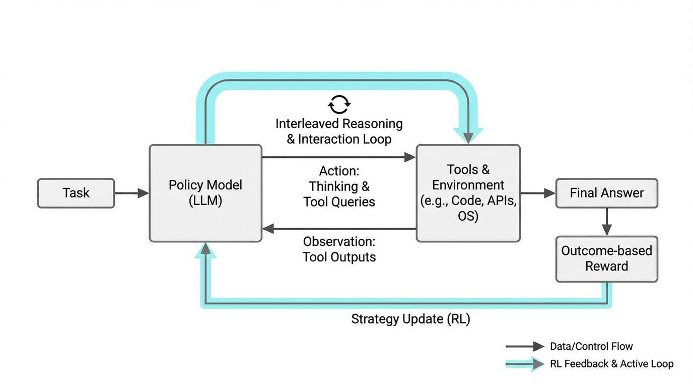
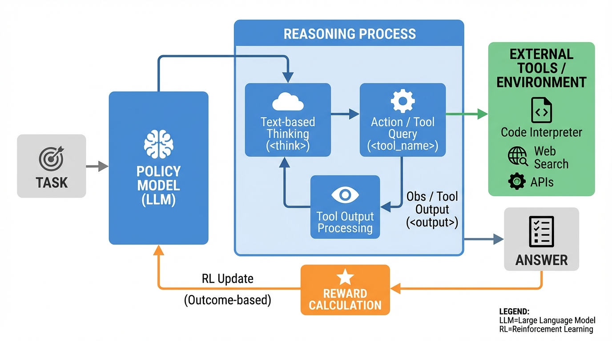
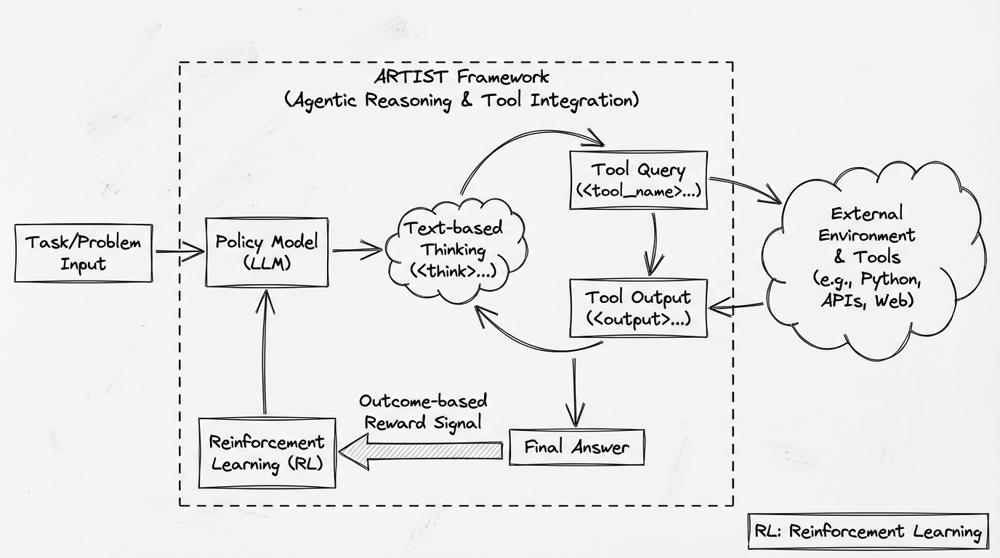
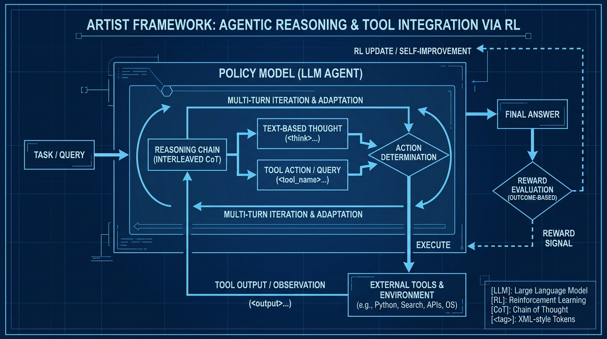

# ARTIST Agentic Reasoning Tool Integration
- Paper: [ARTIST_Agentic_Reasoning_Tool_Integration.pdf](../../../reinforcement_learning_papers/09_agentic_rl/ARTIST_Agentic_Reasoning_Tool_Integration.pdf)

## Gemini diagrams

### Minimal block

### Flat color + icons

### Hand-drawn sketch

### Blueprint schematic

