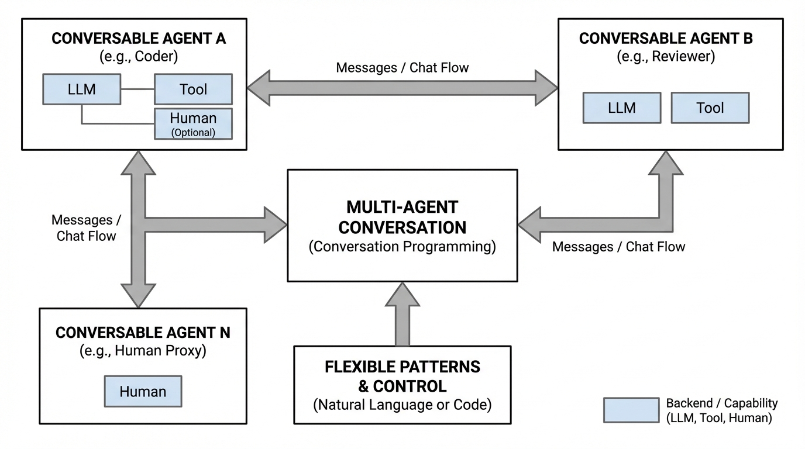
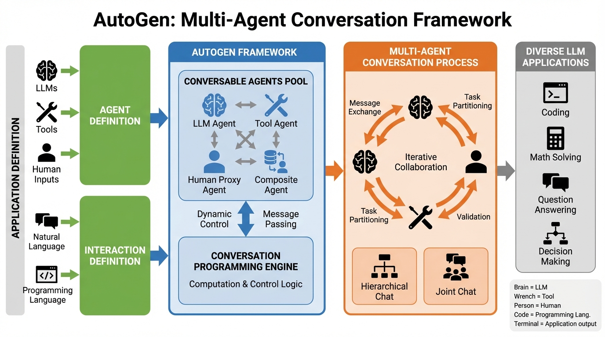
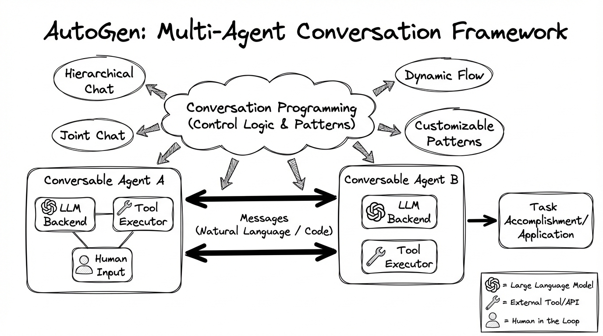
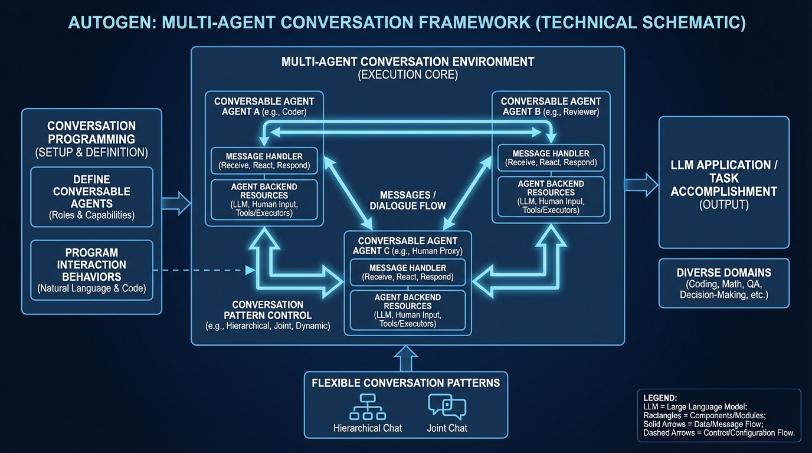

# AutoGen Multi-Agent Conversation
- Paper: [AutoGen_Multi-Agent_Conversation.pdf](../../../reinforcement_learning_papers/09_agentic_rl/AutoGen_Multi-Agent_Conversation.pdf)

## Gemini diagrams

### Minimal block

### Flat color + icons

### Hand-drawn sketch

### Blueprint schematic

