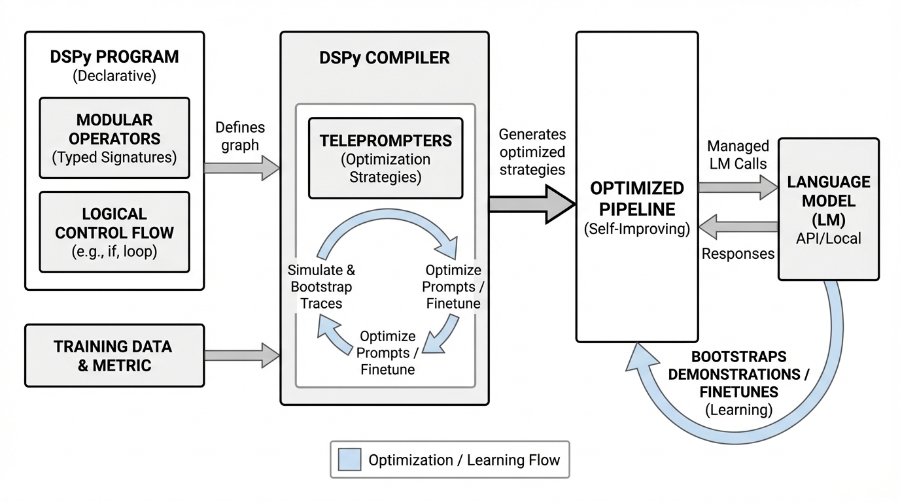
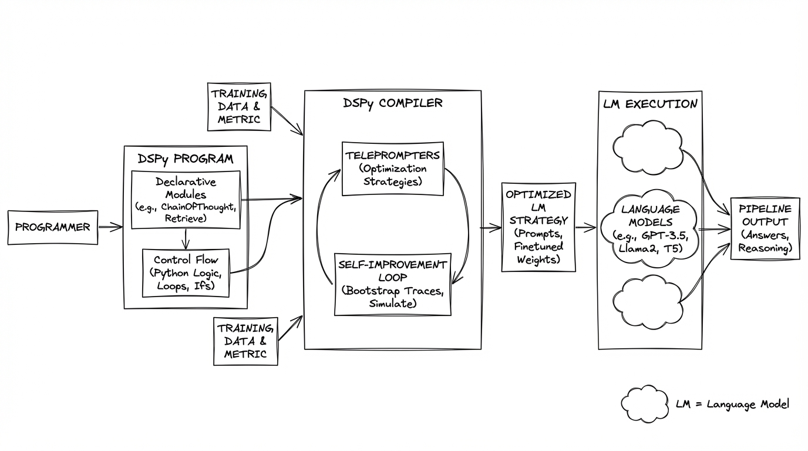
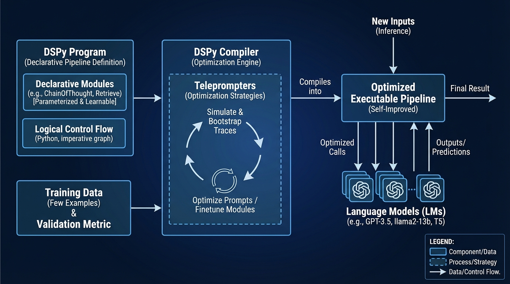

# DSPy Compiling Declarative Language Model
- Paper: [DSPy_Compiling_Declarative_Language_Model.pdf](../../../reinforcement_learning_papers/09_agentic_rl/DSPy_Compiling_Declarative_Language_Model.pdf)

## Gemini diagrams

### Minimal block

### Flat color + icons

### Hand-drawn sketch

### Blueprint schematic

