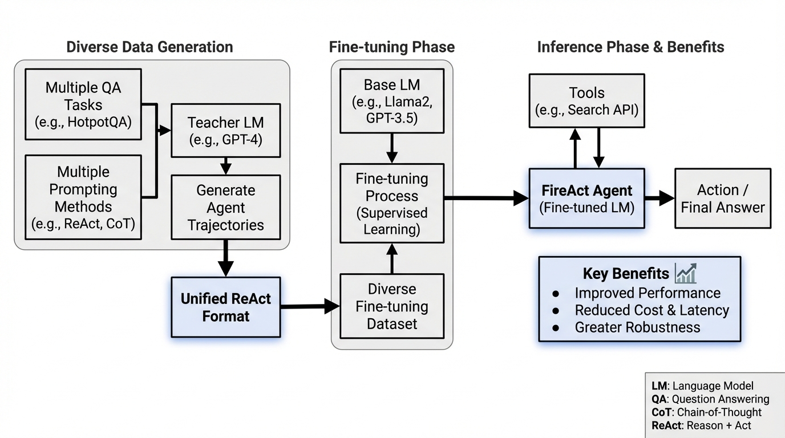
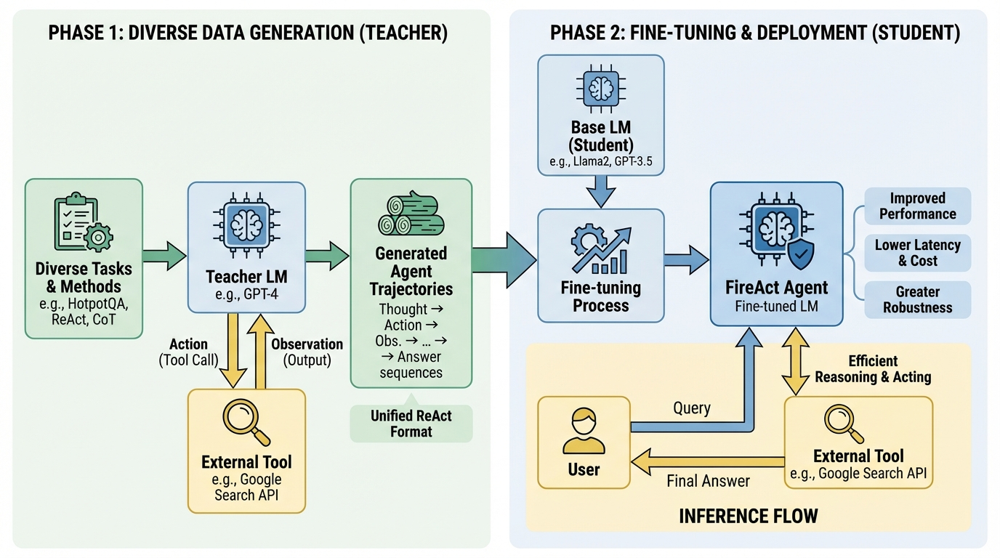
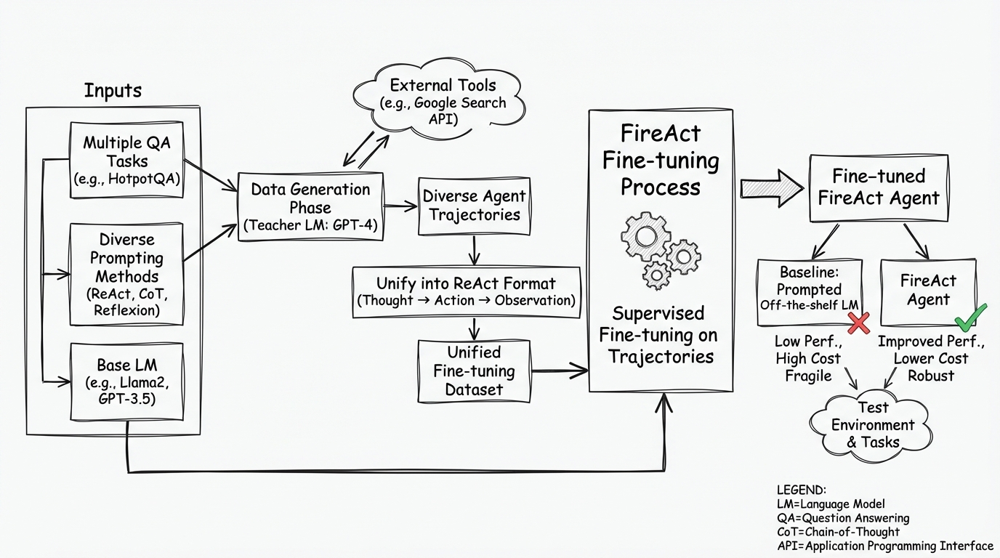
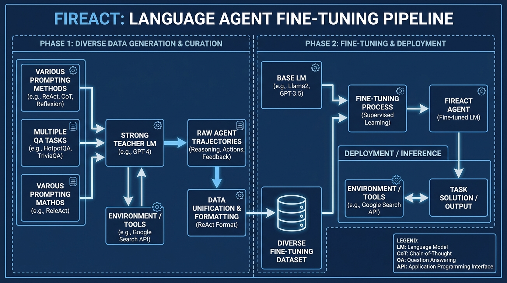

# FireAct Language Agent Fine-tuning
- Paper: [FireAct_Language_Agent_Fine-tuning.pdf](../../../papers/agent-frameworks/FireAct_Language_Agent_Fine-tuning.pdf)

## Gemini diagrams

### Minimal block

### Flat color + icons

### Hand-drawn sketch

### Blueprint schematic

