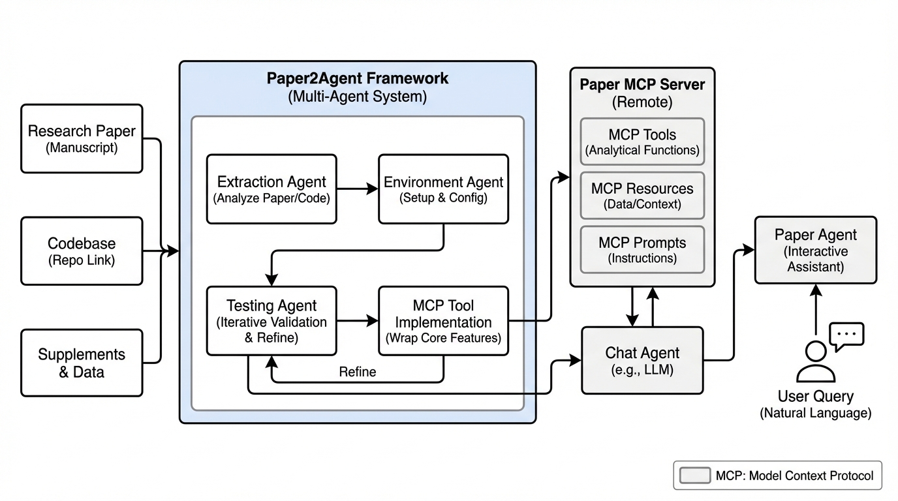
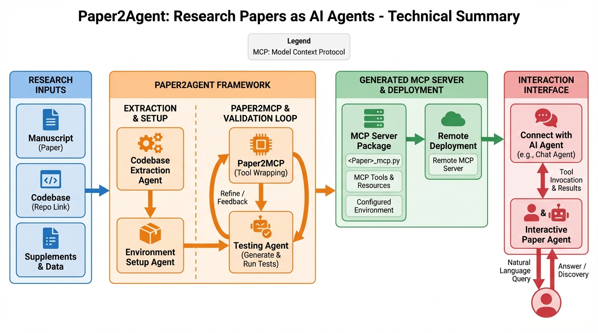
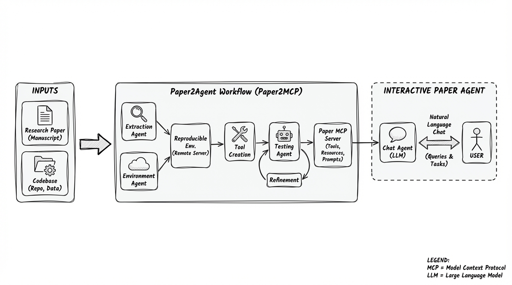
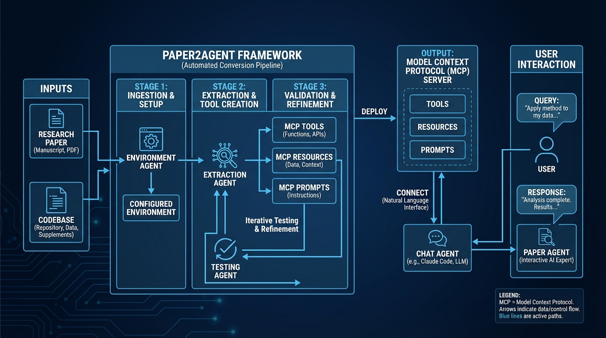

# Paper2Agent Research Papers as AI Agents
- Paper: [Paper2Agent_Research_Papers_as_AI_Agents.pdf](../../../papers/agent-frameworks/Paper2Agent_Research_Papers_as_AI_Agents.pdf)

## Gemini diagrams

### Minimal block

### Flat color + icons

### Hand-drawn sketch

### Blueprint schematic

