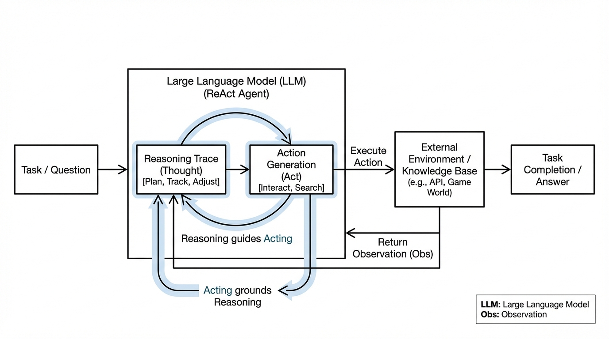
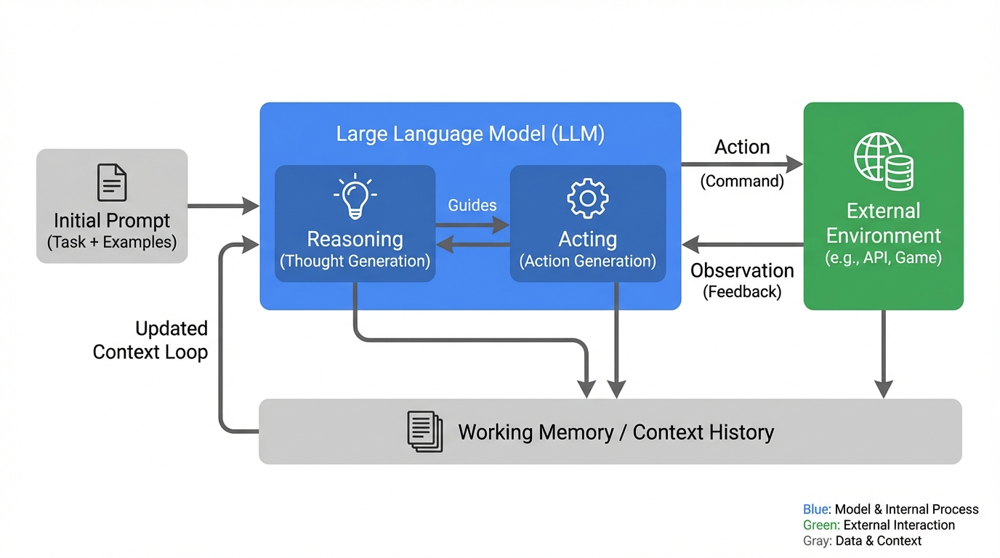
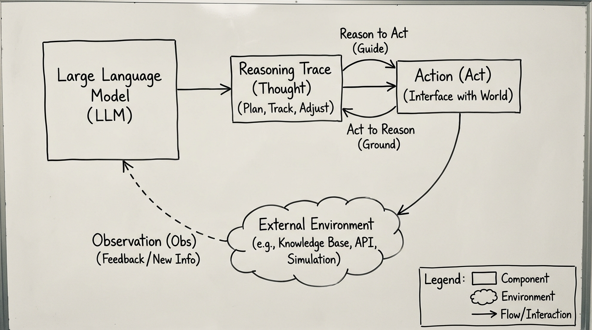
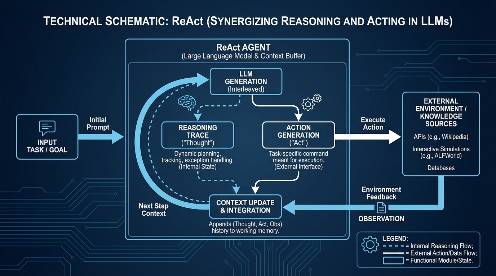

# ReAct Synergizing Reasoning and Acting
- Paper: [ReAct_Synergizing_Reasoning_and_Acting.pdf](../../../reinforcement_learning_papers/09_agentic_rl/ReAct_Synergizing_Reasoning_and_Acting.pdf)

## Gemini diagrams

### Minimal block

### Flat color + icons

### Hand-drawn sketch

### Blueprint schematic

