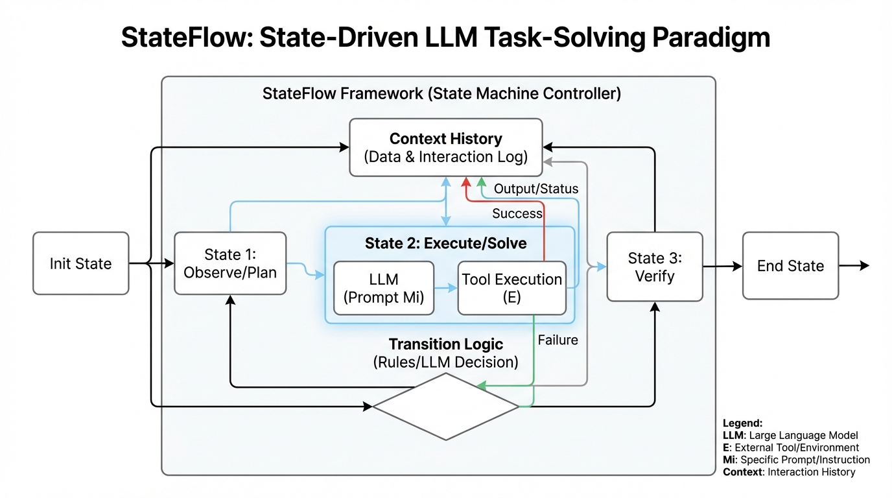
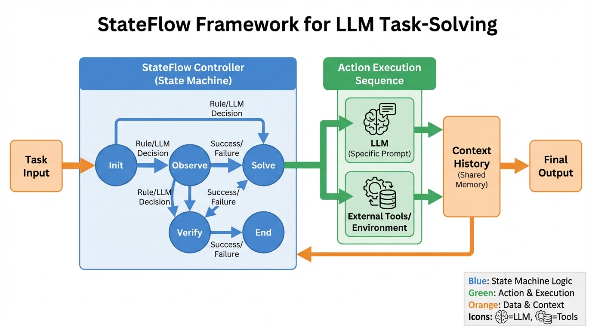
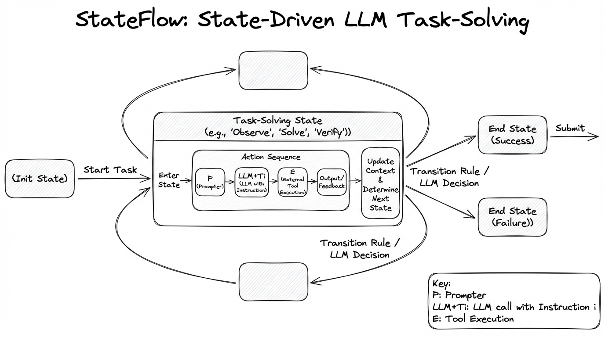
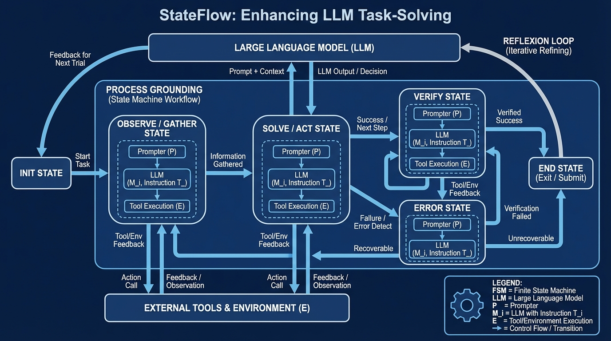

# StateFlow Enhancing LLM Task-Solving
- Paper: [StateFlow_Enhancing_LLM_Task-Solving.pdf](../../../reinforcement_learning_papers/09_agentic_rl/StateFlow_Enhancing_LLM_Task-Solving.pdf)

## Gemini diagrams

### Minimal block

### Flat color + icons

### Hand-drawn sketch

### Blueprint schematic

