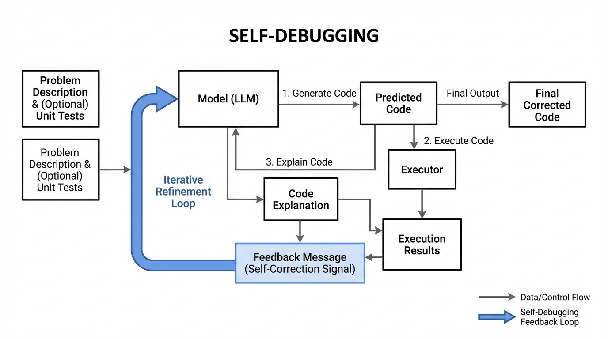
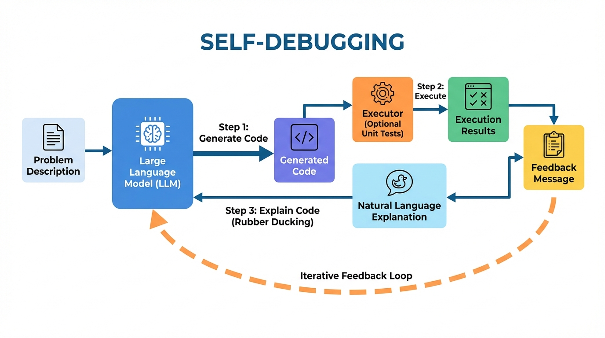
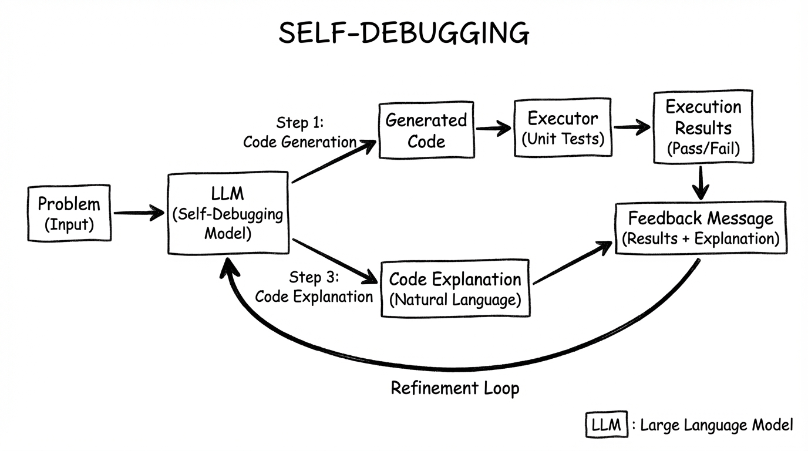
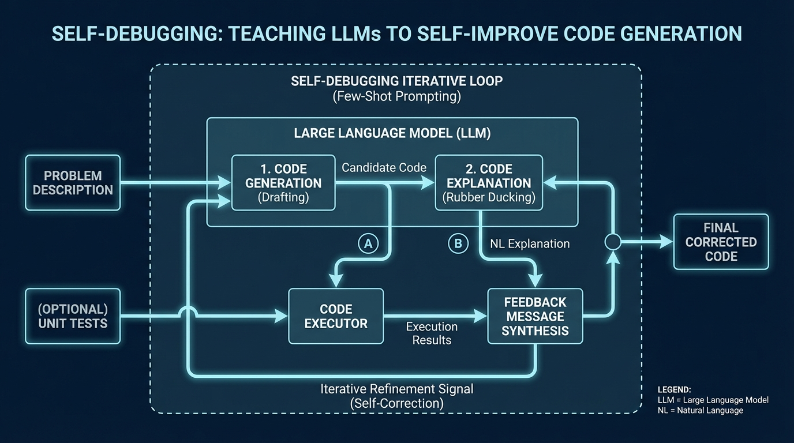

# Teaching Large Language Models to Self-Debug
- Paper: [Teaching_Large_Language_Models_to_Self-Debug.pdf](../../../papers/agent-frameworks/Teaching_Large_Language_Models_to_Self-Debug.pdf)

## Gemini diagrams

### Minimal block

### Flat color + icons

### Hand-drawn sketch

### Blueprint schematic

