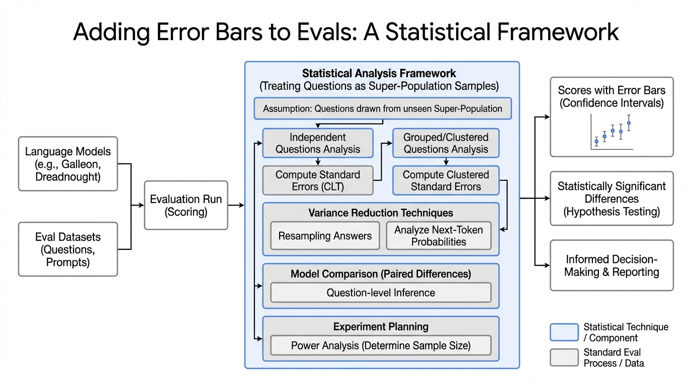
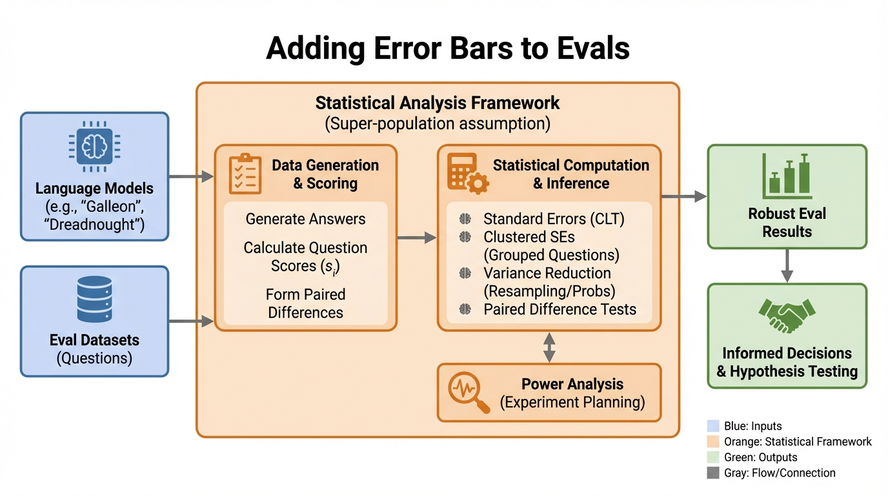
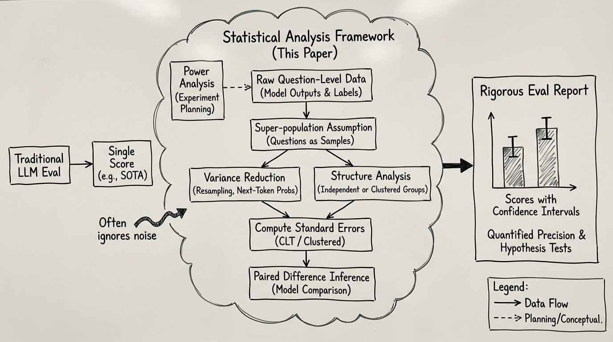
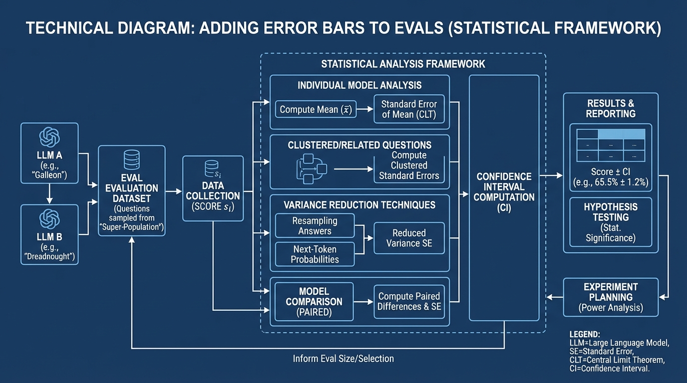

# Adding Error Bars to Evals
- Paper: [Adding_Error_Bars_to_Evals.pdf](../../../papers/benchmarks/Adding_Error_Bars_to_Evals.pdf)

## Gemini diagrams

### Minimal block

### Flat color + icons

### Hand-drawn sketch

### Blueprint schematic

