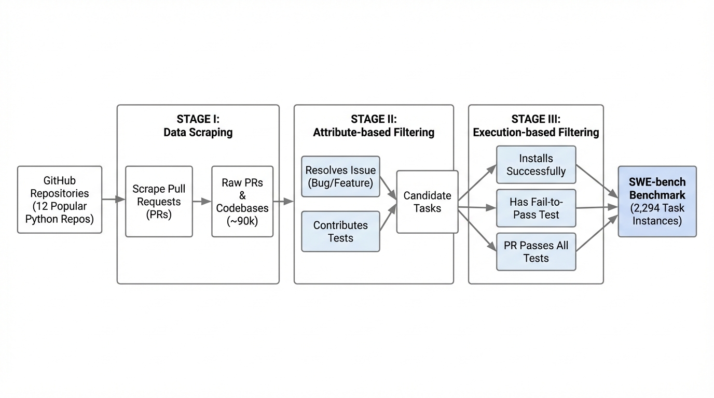
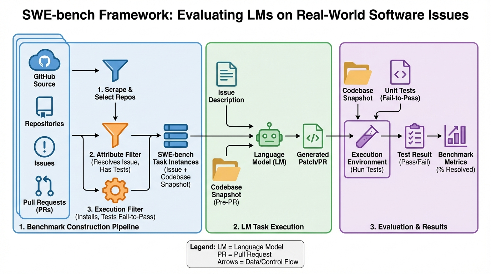
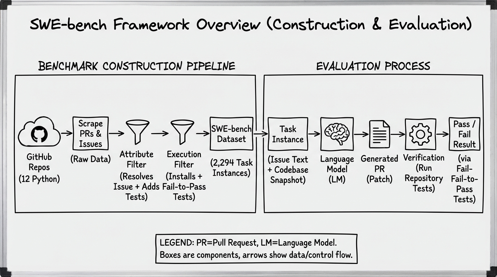
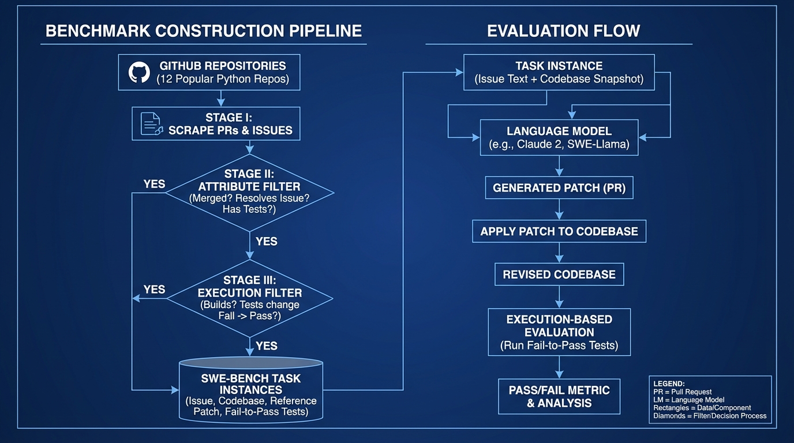

# SWE-bench Verified
- Paper: [SWE-bench_Verified.pdf](../../../papers/benchmarks/SWE-bench_Verified.pdf)

## Gemini diagrams

### Minimal block

### Flat color + icons

### Hand-drawn sketch

### Blueprint schematic

