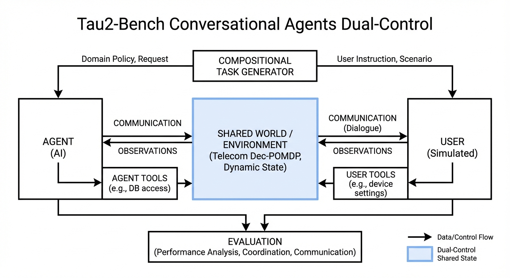
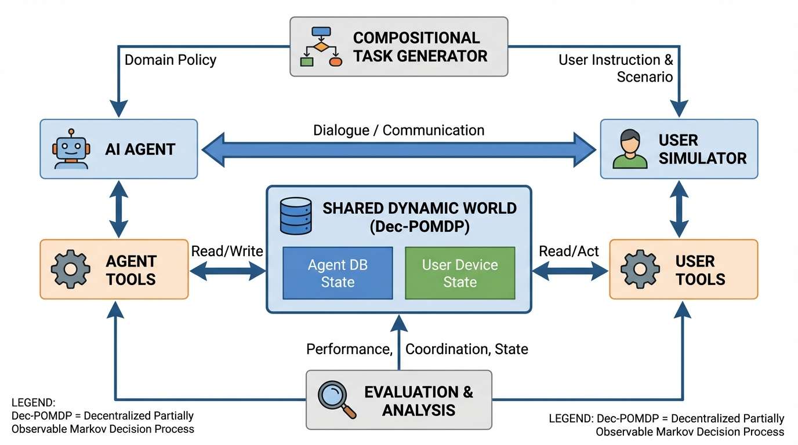
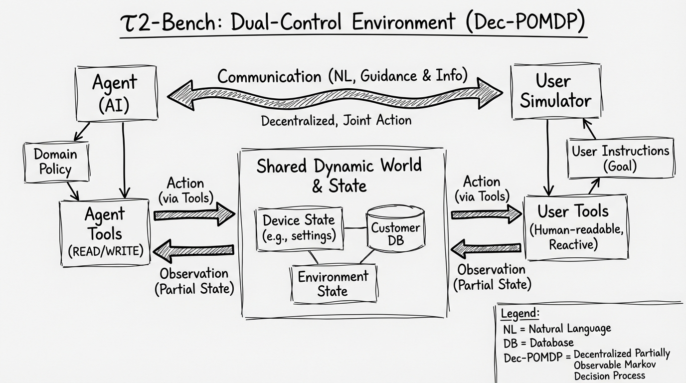
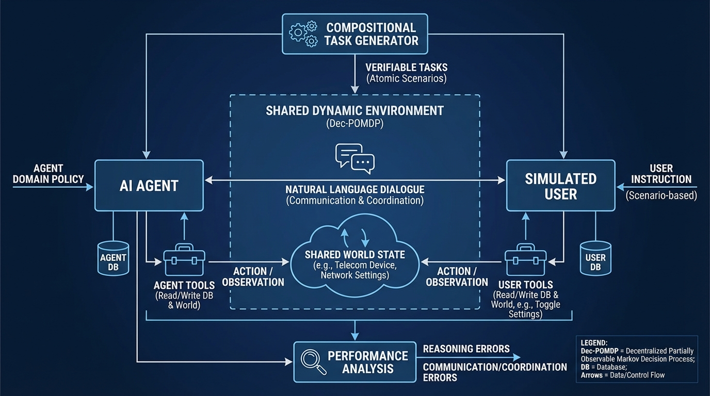

# Tau2-Bench Conversational Agents Dual-Control
- Paper: [Tau2-Bench_Conversational_Agents_Dual-Control.pdf](../../../reinforcement_learning_papers/09_agentic_rl/Tau2-Bench_Conversational_Agents_Dual-Control.pdf)

## Gemini diagrams

### Minimal block

### Flat color + icons

### Hand-drawn sketch

### Blueprint schematic

