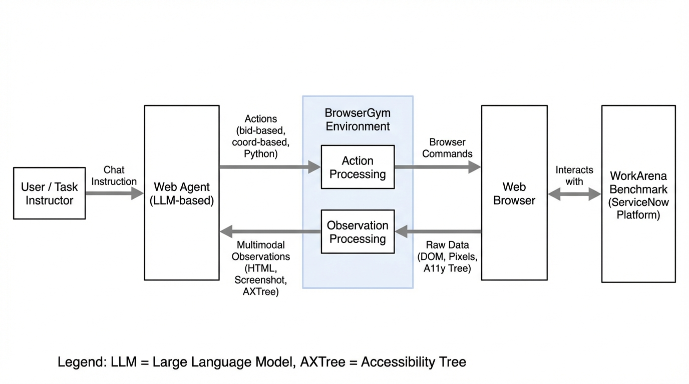
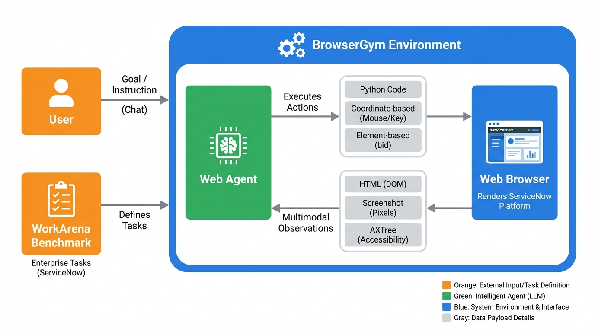
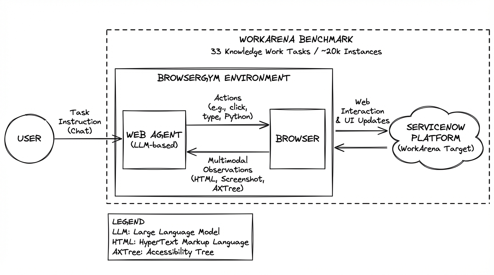

# WorkArena Common Knowledge Work Tasks
- Paper: [WorkArena_Common_Knowledge_Work_Tasks.pdf](../../../papers/benchmarks/WorkArena_Common_Knowledge_Work_Tasks.pdf)

## Gemini diagrams

### Minimal block

### Flat color + icons

### Hand-drawn sketch

### Blueprint schematic

