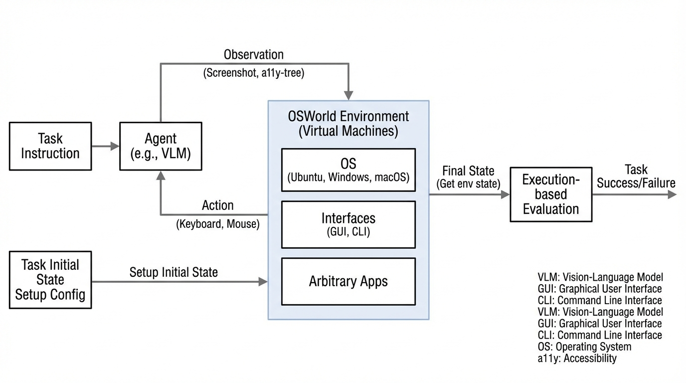
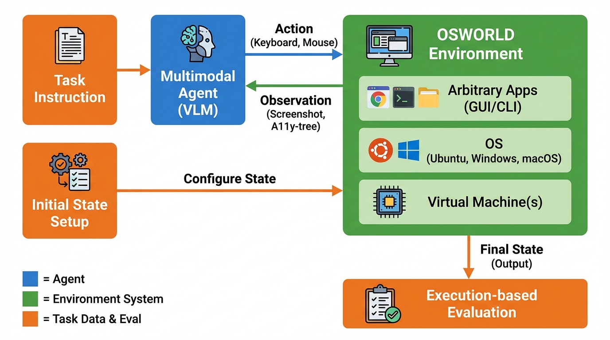
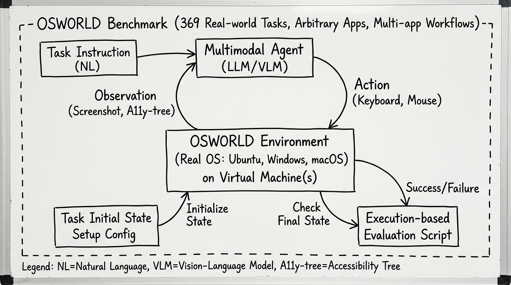
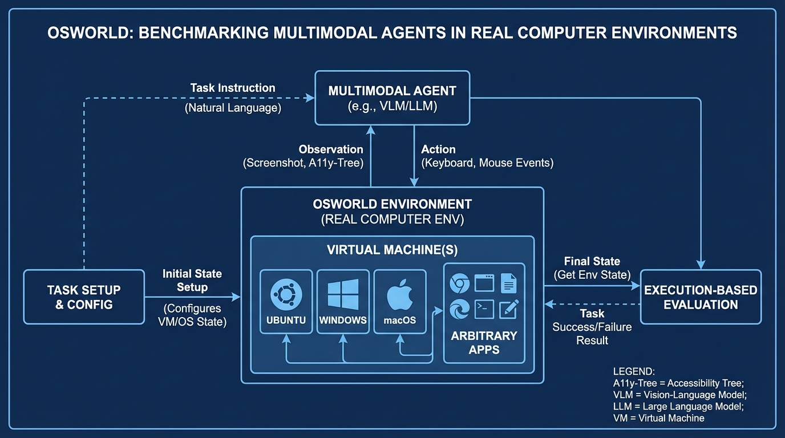

# OSWORLD Benchmarking Multimodal Agents
- Paper: [OSWORLD_Benchmarking_Multimodal_Agents.pdf](../../../papers/computer-use/OSWORLD_Benchmarking_Multimodal_Agents.pdf)

## Gemini diagrams

### Minimal block

### Flat color + icons

### Hand-drawn sketch

### Blueprint schematic

