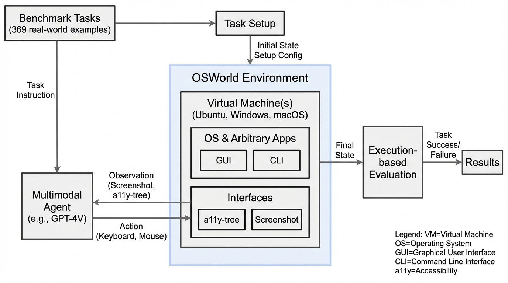
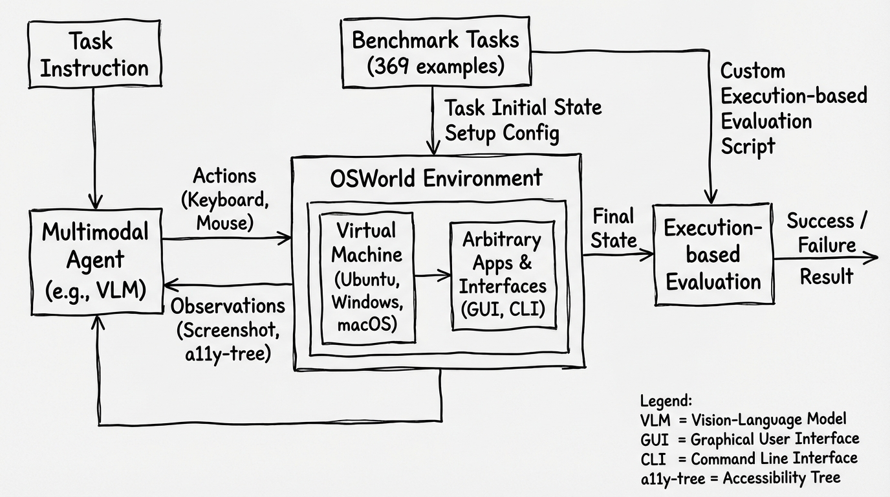
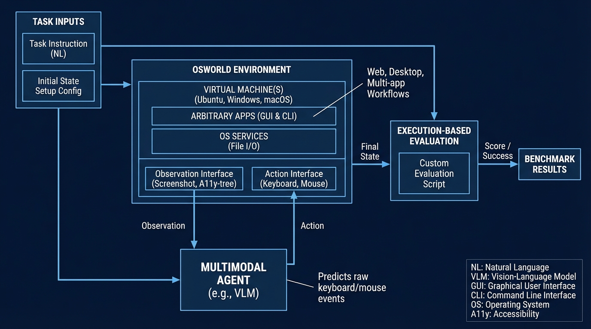

# OSWorld Multimodal Agents Benchmark
- Paper: [OSWorld_Multimodal_Agents_Benchmark.pdf](../../../reinforcement_learning_papers/09_agentic_rl/OSWorld_Multimodal_Agents_Benchmark.pdf)

## Gemini diagrams

### Minimal block

### Flat color + icons

### Hand-drawn sketch

### Blueprint schematic

