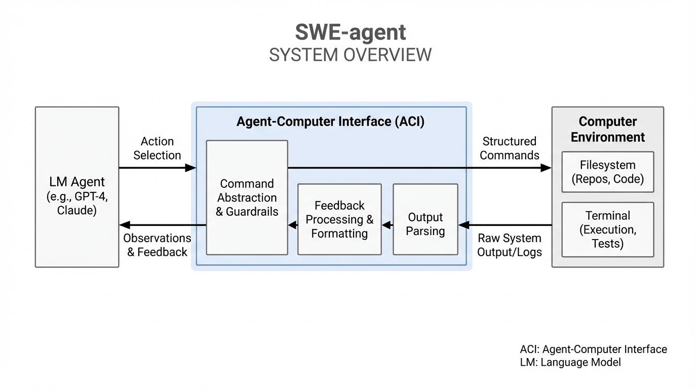
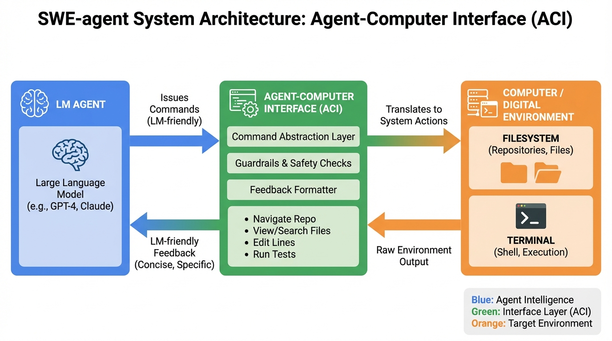
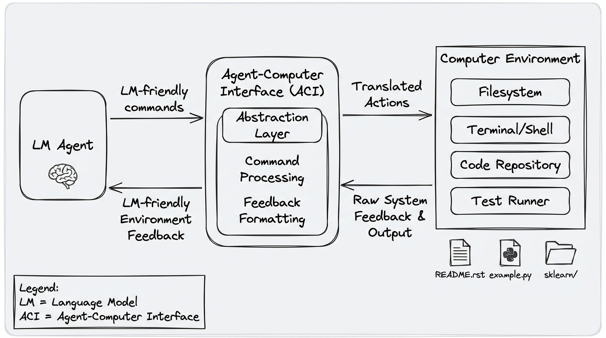
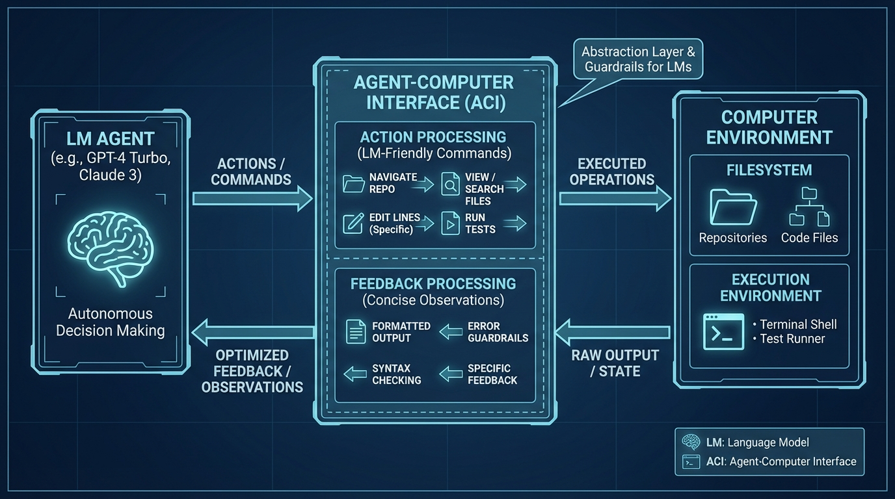

# SWE-agent Agent-Computer Interfaces
- Paper: [SWE-agent_Agent-Computer_Interfaces.pdf](../../../reinforcement_learning_papers/09_agentic_rl/SWE-agent_Agent-Computer_Interfaces.pdf)

## Gemini diagrams

### Minimal block

### Flat color + icons

### Hand-drawn sketch

### Blueprint schematic

