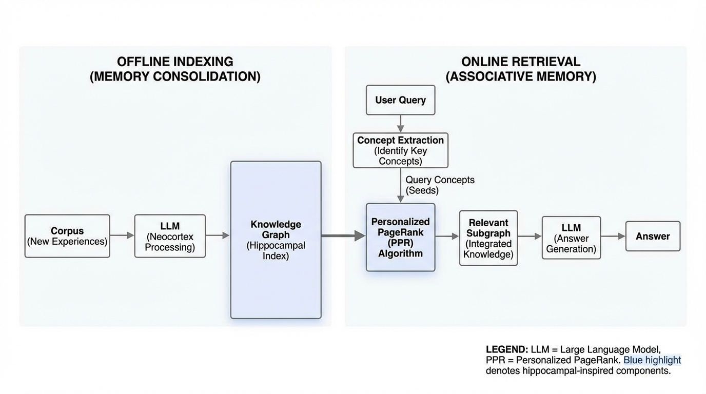
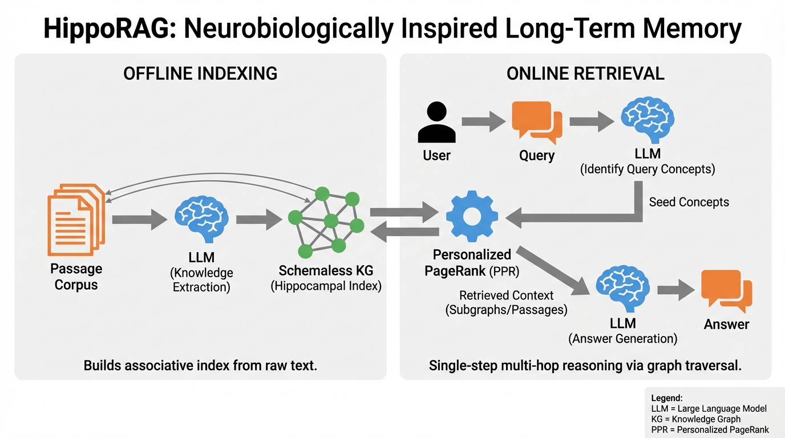
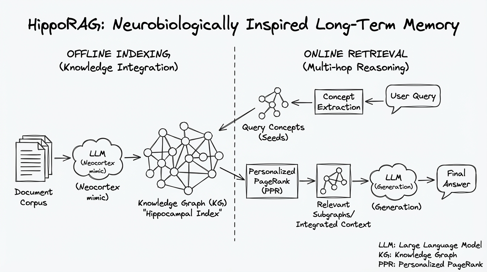
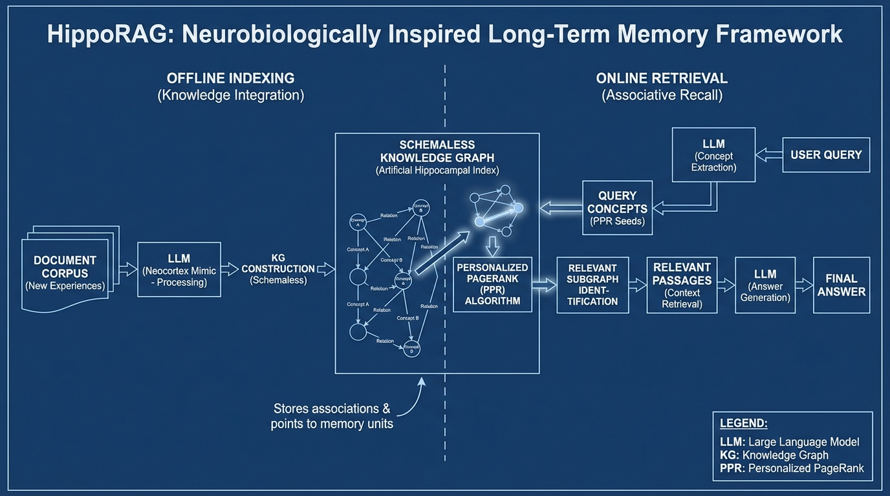

# HippoRAG Neurobiologically Inspired Long-Term Memory
- Paper: [HippoRAG_Neurobiologically_Inspired_Long-Term_Memory.pdf](../../../papers/memory-rag/HippoRAG_Neurobiologically_Inspired_Long-Term_Memory.pdf)

## Gemini diagrams

### Minimal block

### Flat color + icons

### Hand-drawn sketch

### Blueprint schematic

