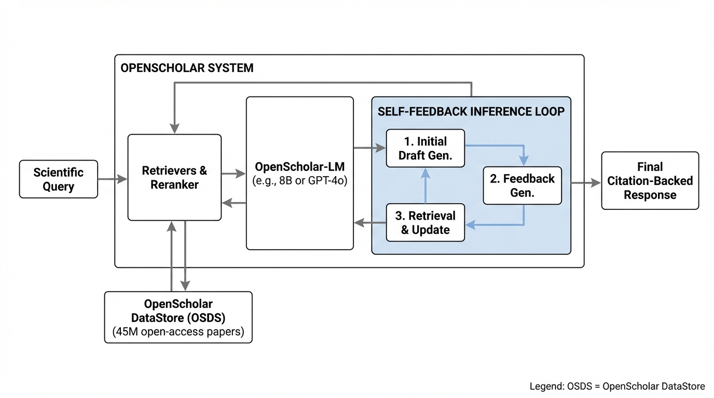
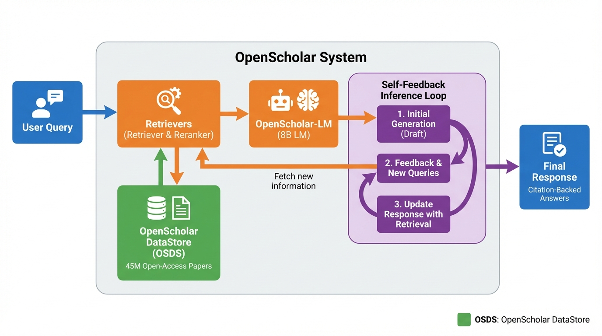
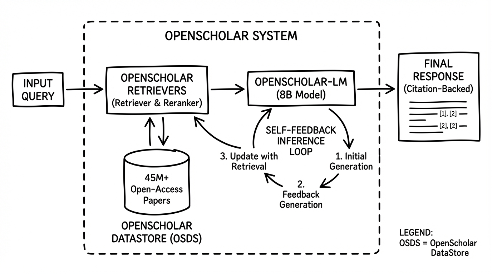
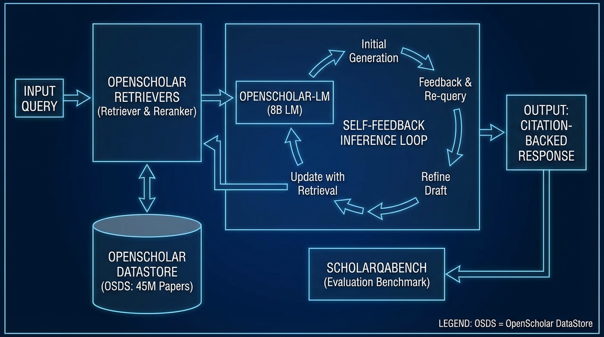

# OpenScholar Synthesizing Scientific Literature
- Paper: [OpenScholar_Synthesizing_Scientific_Literature.pdf](../../../papers/memory-rag/OpenScholar_Synthesizing_Scientific_Literature.pdf)

## Gemini diagrams

### Minimal block

### Flat color + icons

### Hand-drawn sketch

### Blueprint schematic

