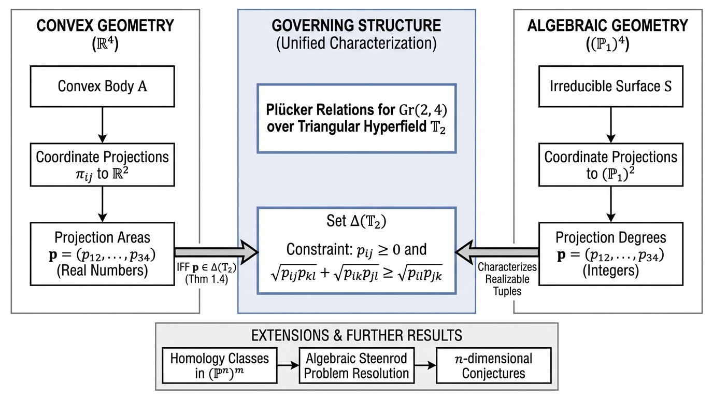
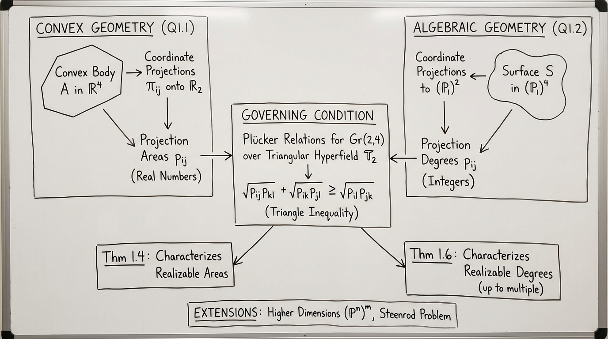
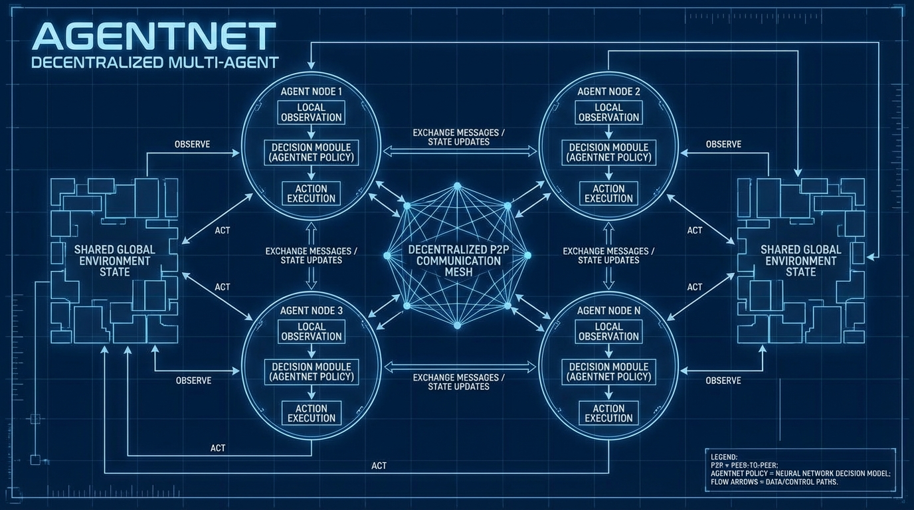

# AgentNet Decentralized Multi-Agent
- Paper: [AgentNet_Decentralized_Multi-Agent.pdf](../../../reinforcement_learning_papers/03_multi_agent_rl/AgentNet_Decentralized_Multi-Agent.pdf)

## Gemini diagrams

### Minimal block

### Flat color + icons

### Hand-drawn sketch

### Blueprint schematic

