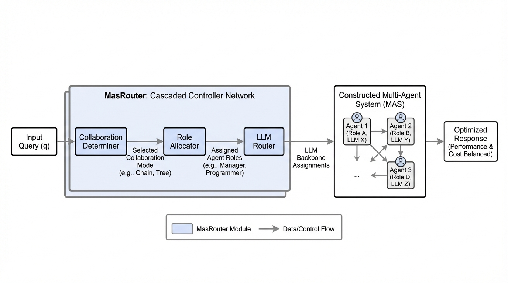
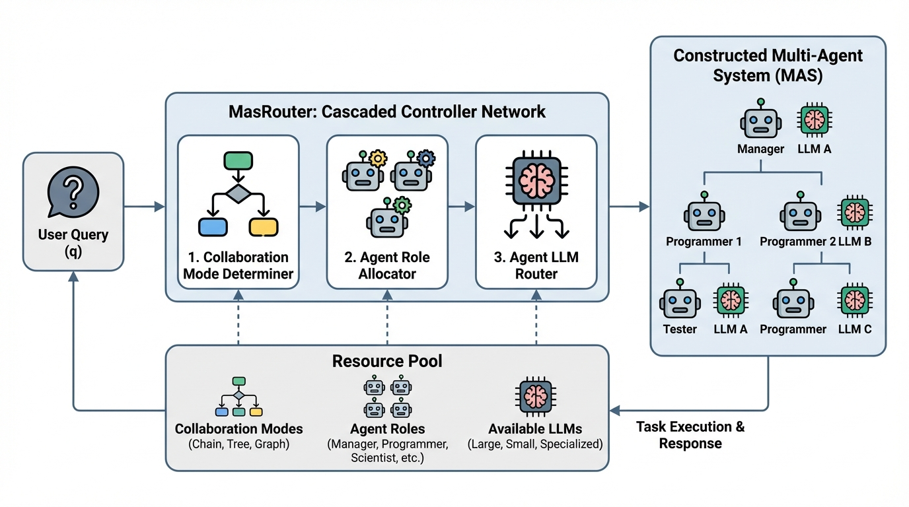
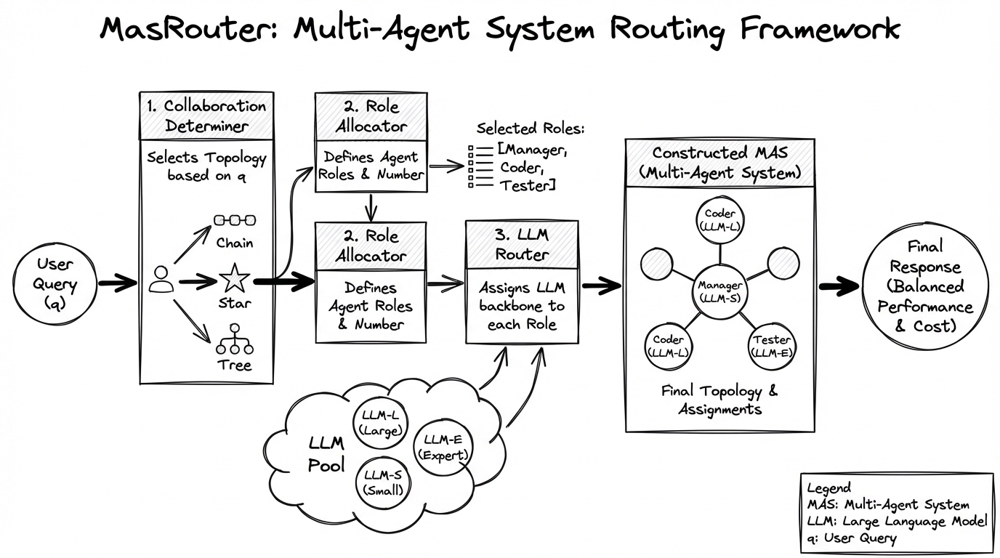

# MasRouter Multi-Agent Routing
- Paper: [MasRouter_Multi-Agent_Routing.pdf](../../../papers/multi-agent/MasRouter_Multi-Agent_Routing.pdf)

## Gemini diagrams

### Minimal block

### Flat color + icons

### Hand-drawn sketch

### Blueprint schematic

