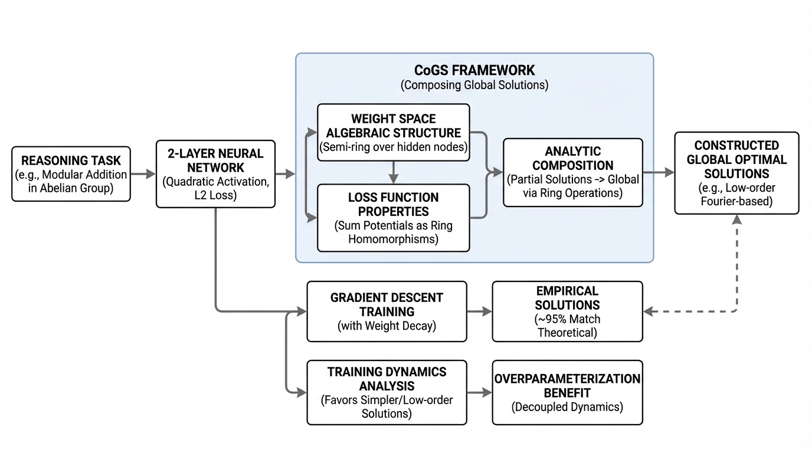
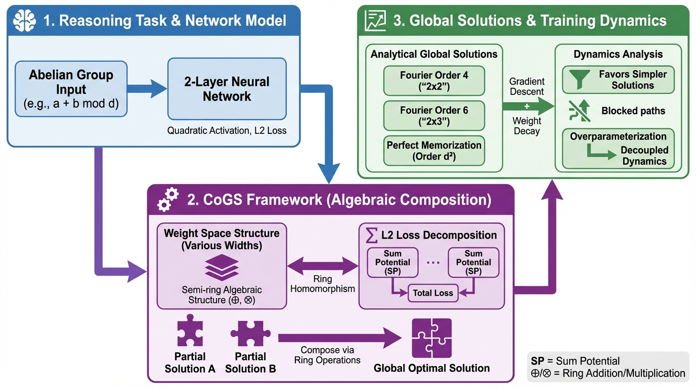
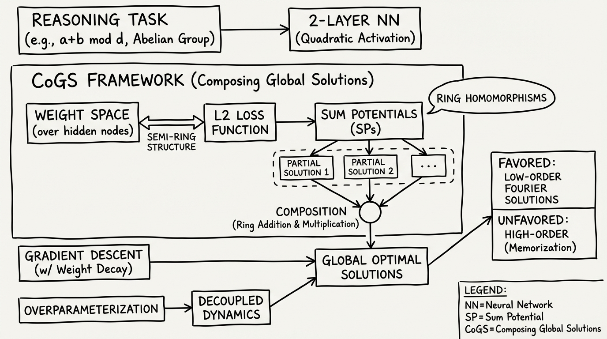
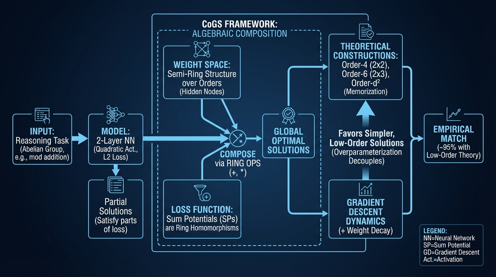

# Composing Global Optimizers Algebraic Objects
- Paper: [Composing_Global_Optimizers_Algebraic_Objects.pdf](../../../reinforcement_learning_papers/09_agentic_rl/Composing_Global_Optimizers_Algebraic_Objects.pdf)

## Gemini diagrams

### Minimal block

### Flat color + icons

### Hand-drawn sketch

### Blueprint schematic

