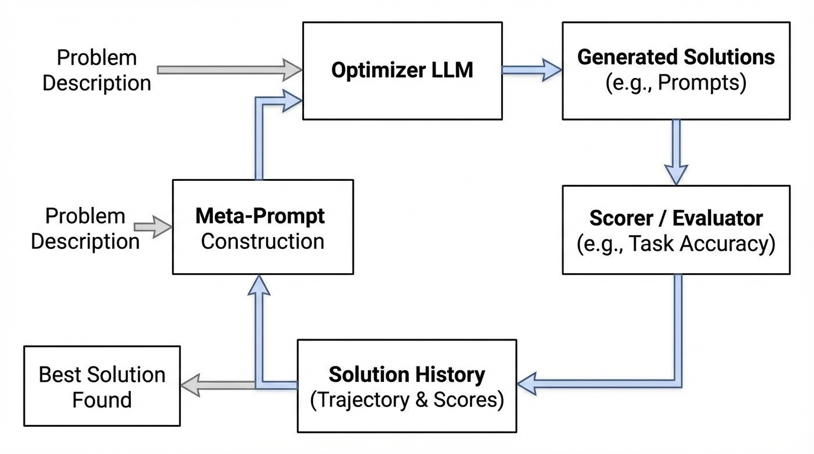
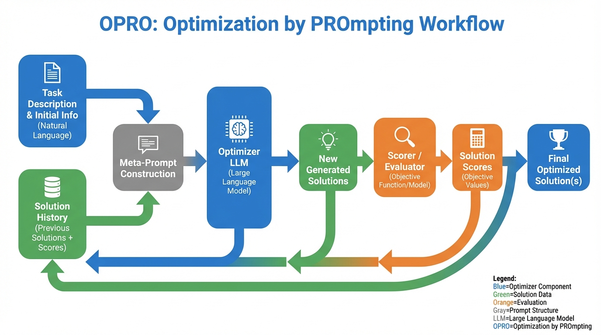
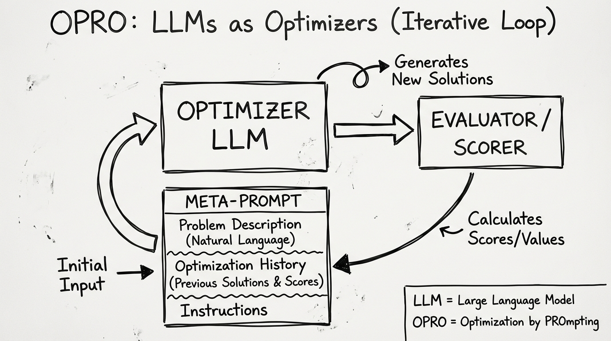
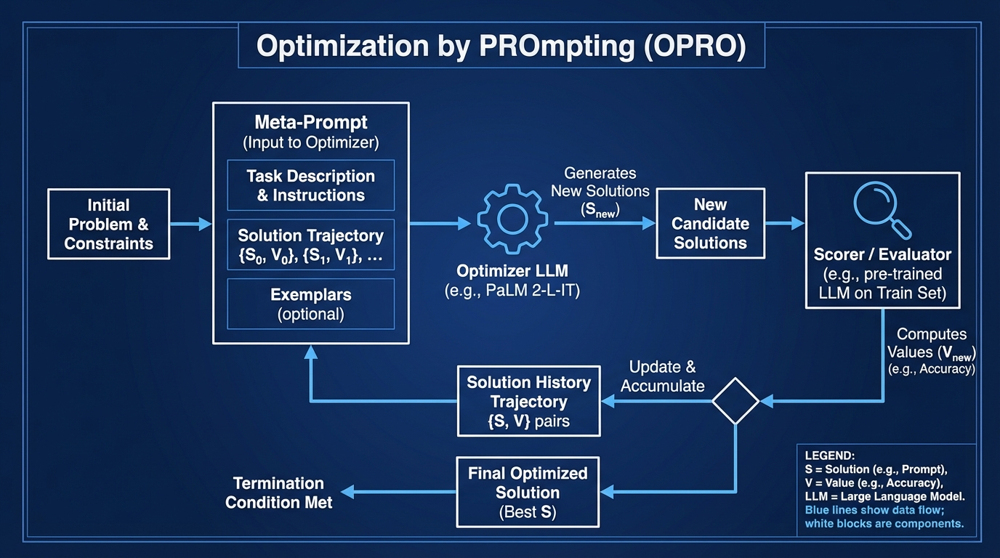

# Large Language Models as Optimizers
- Paper: [Large_Language_Models_as_Optimizers.pdf](../../../reinforcement_learning_papers/09_agentic_rl/Large_Language_Models_as_Optimizers.pdf)

## Gemini diagrams

### Minimal block

### Flat color + icons

### Hand-drawn sketch

### Blueprint schematic

