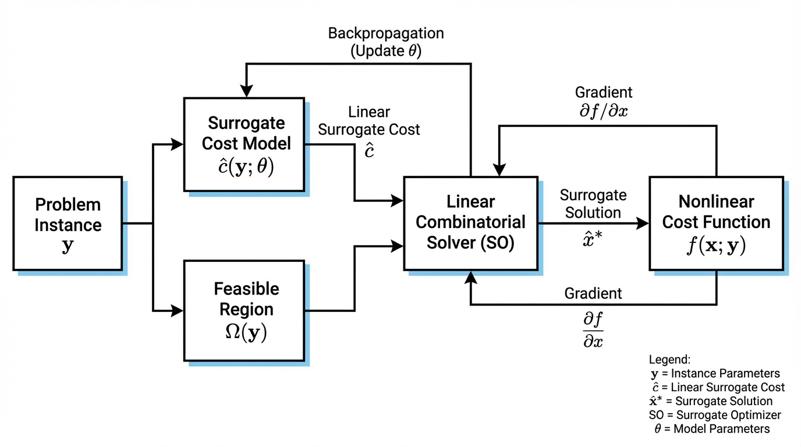
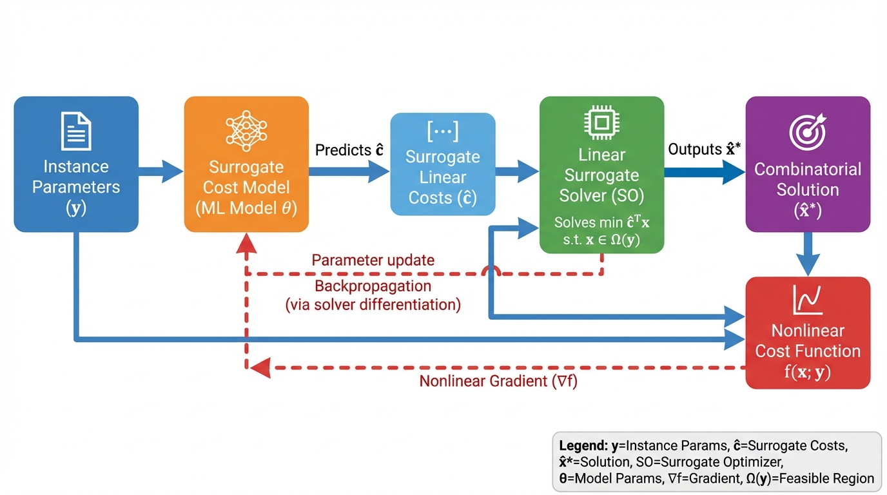
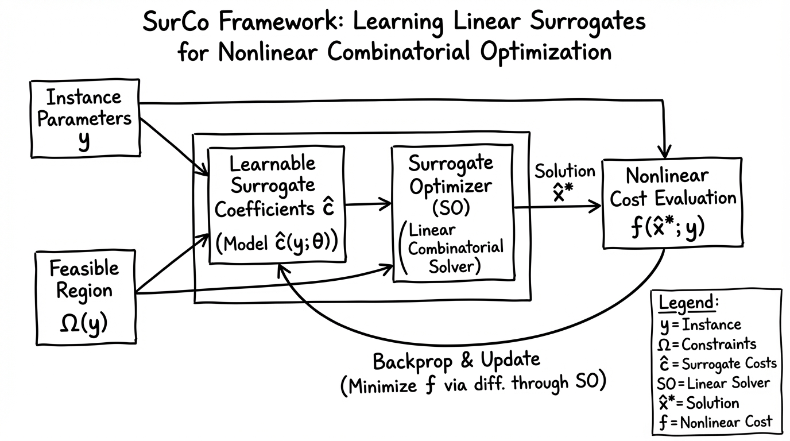
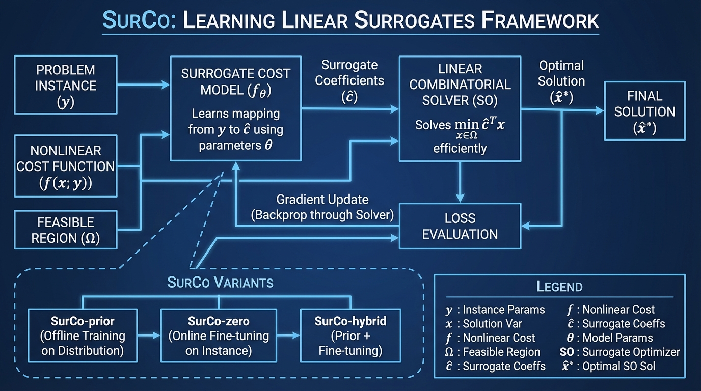

# SurCo Learning Linear Surrogates
- Paper: [SurCo_Learning_Linear_Surrogates.pdf](../../../reinforcement_learning_papers/09_agentic_rl/SurCo_Learning_Linear_Surrogates.pdf)

## Gemini diagrams

### Minimal block

### Flat color + icons

### Hand-drawn sketch

### Blueprint schematic

