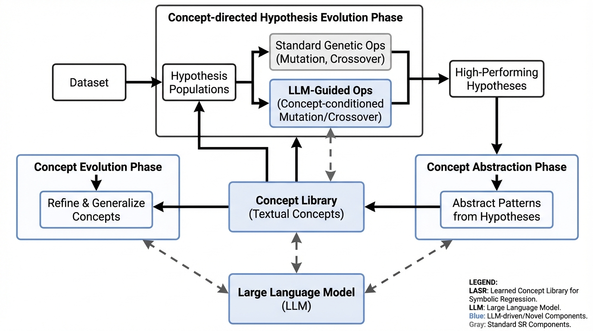
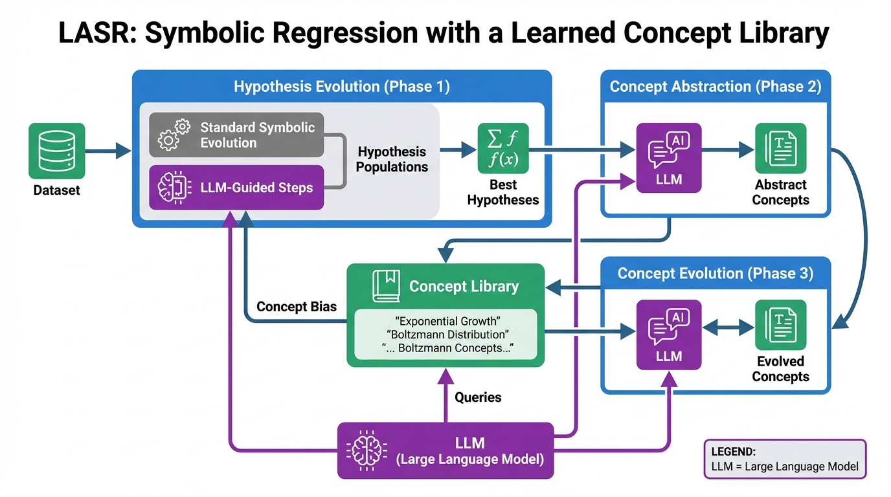
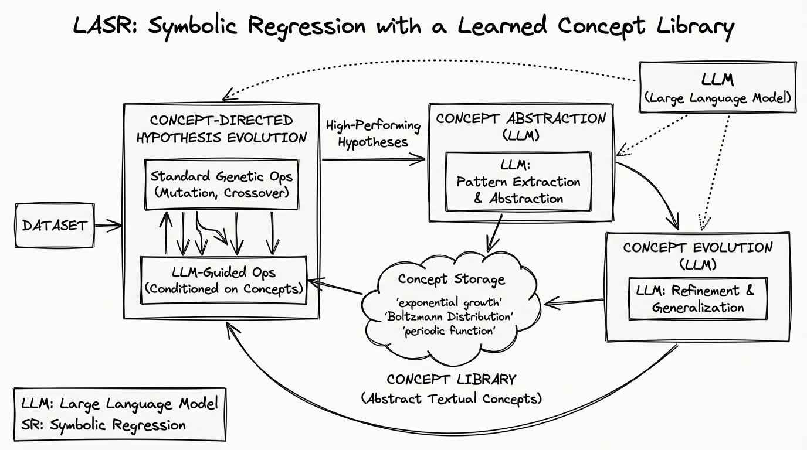
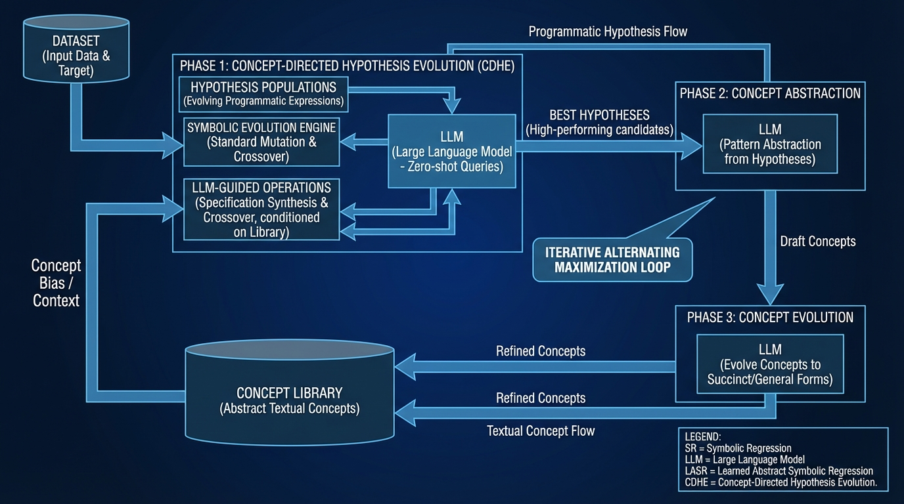

# Symbolic Regression Learned Concept Library
- Paper: [Symbolic_Regression_Learned_Concept_Library.pdf](../../../reinforcement_learning_papers/09_agentic_rl/Symbolic_Regression_Learned_Concept_Library.pdf)

## Gemini diagrams

### Minimal block

### Flat color + icons

### Hand-drawn sketch

### Blueprint schematic

