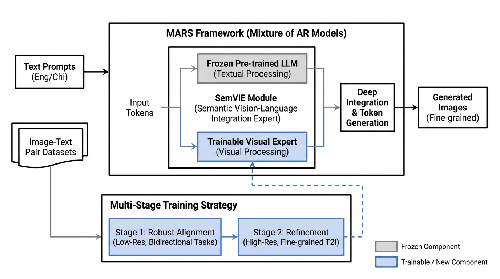
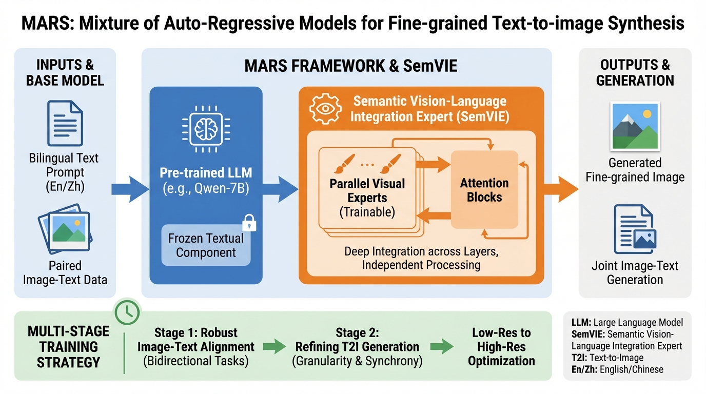
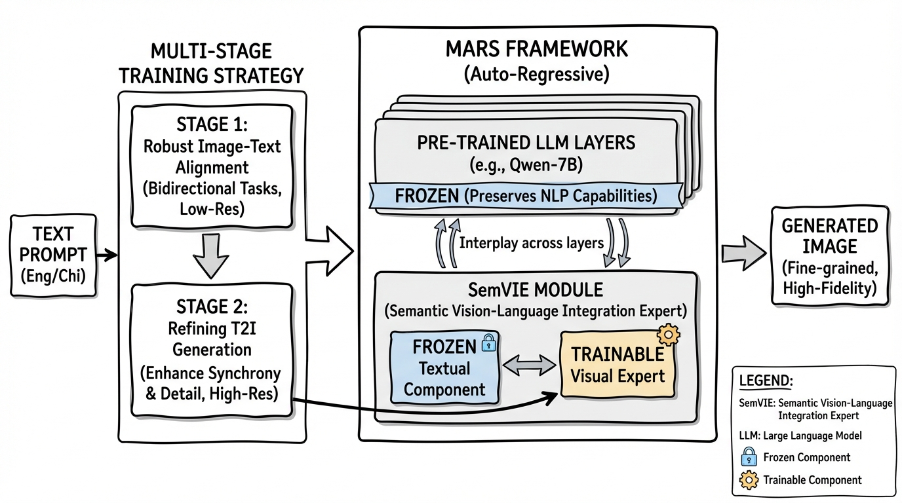
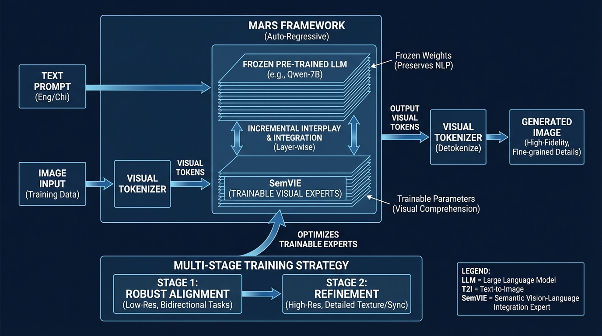

# Tree Search for Language Model Agents
- Paper: [Tree_Search_for_Language_Model_Agents.pdf](../../../papers/planning/Tree_Search_for_Language_Model_Agents.pdf)

## Gemini diagrams

### Minimal block

### Flat color + icons

### Hand-drawn sketch

### Blueprint schematic

