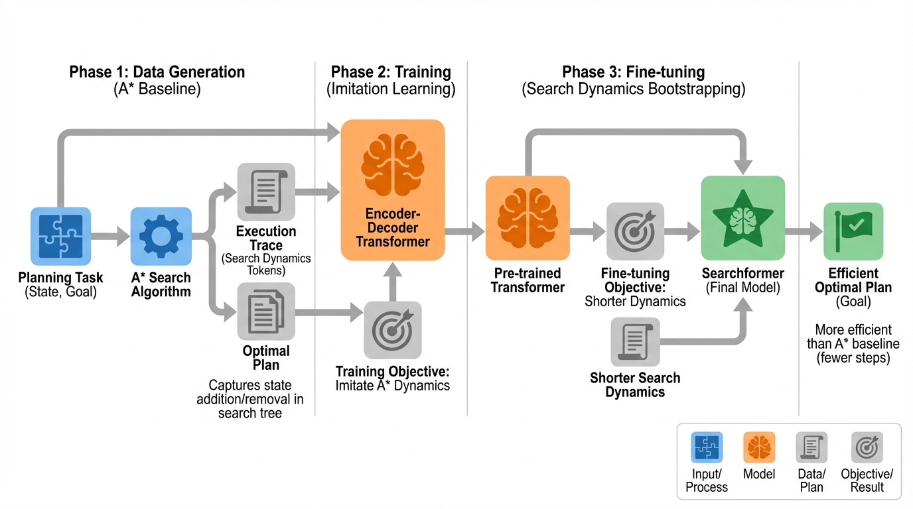
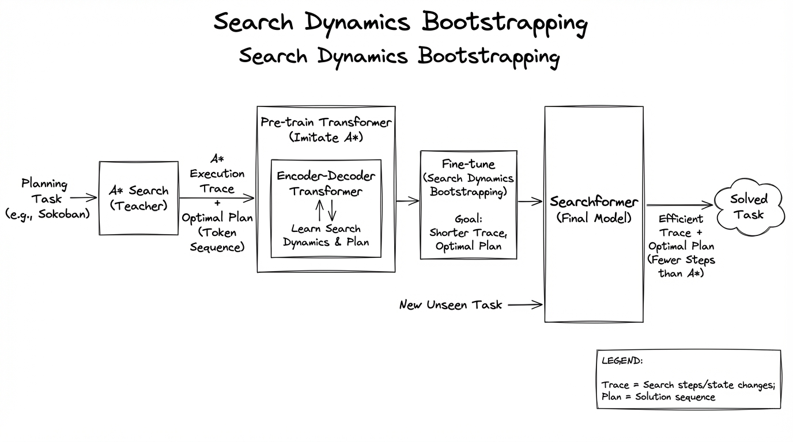
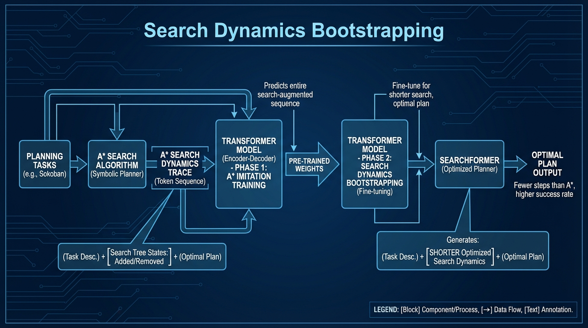

# Beyond A-Star Better Planning Transformers
- Paper: [Beyond_A-Star_Better_Planning_Transformers.pdf](../../../papers/reasoning/Beyond_A-Star_Better_Planning_Transformers.pdf)

## Gemini diagrams

### Minimal block

### Flat color + icons

### Hand-drawn sketch

### Blueprint schematic

