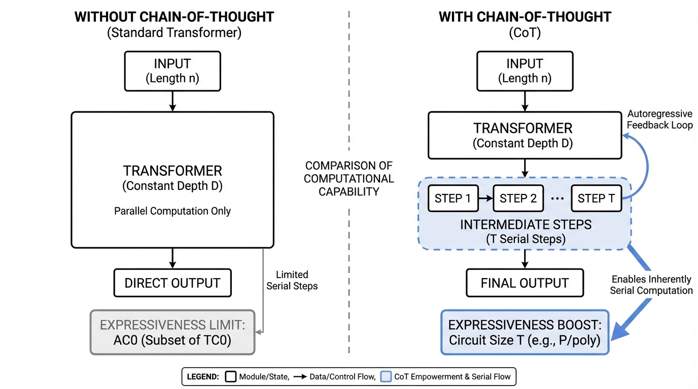
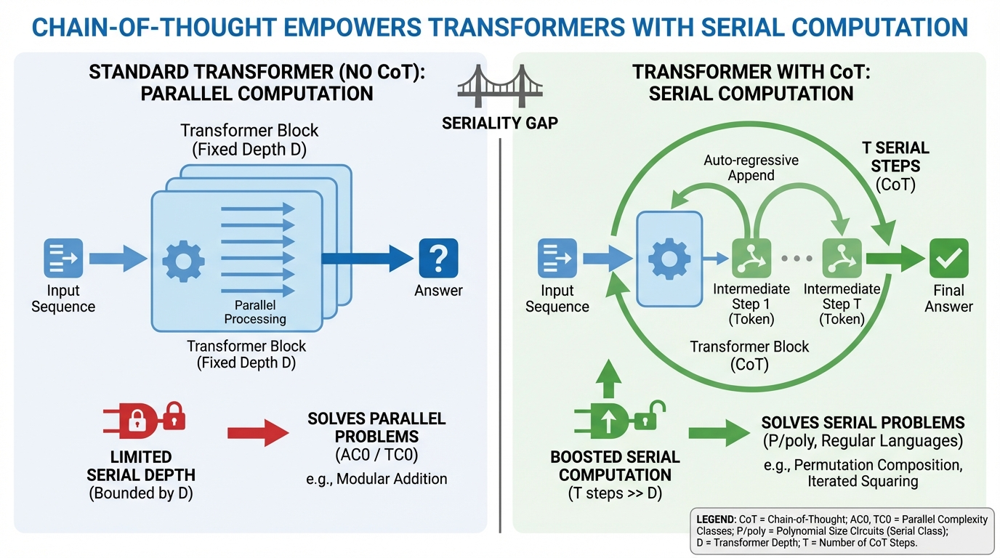
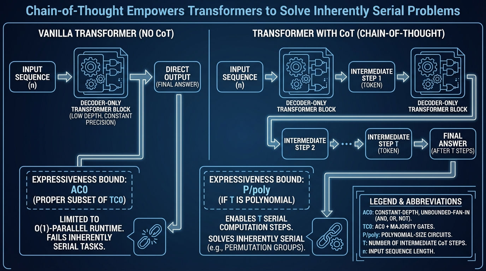

# Chain-of-Thought Empowers Transformers to Solve Inherently Serial Problems
- Paper: [Chain-of-Thought_Empowers_Transformers_to_Solve_Inherently_Serial_Problems.pdf](../../../papers/reasoning/Chain-of-Thought_Empowers_Transformers_to_Solve_Inherently_Serial_Problems.pdf)

## Gemini diagrams

### Minimal block

### Flat color + icons

### Hand-drawn sketch

### Blueprint schematic

