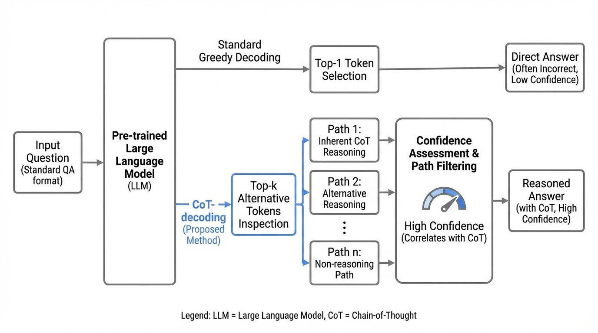
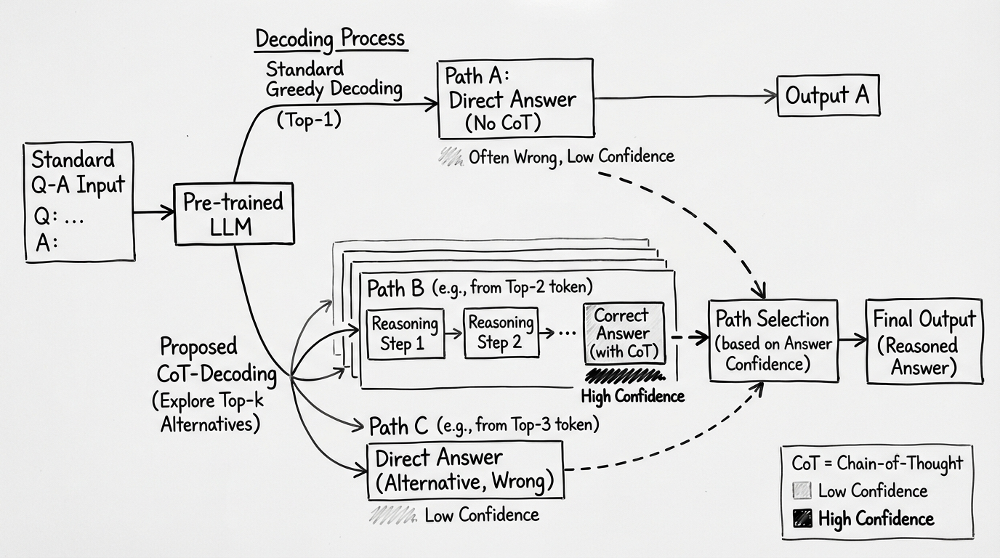
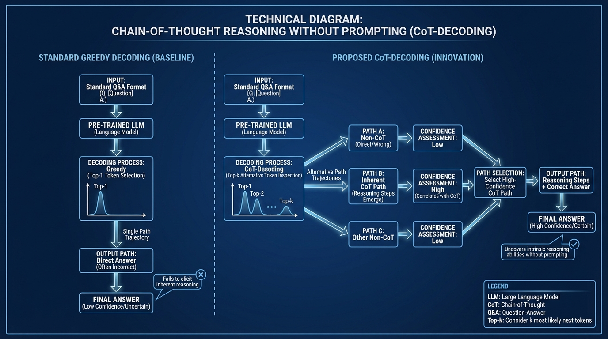

# Chain-of-Thought Reasoning Without Prompting
- Paper: [Chain-of-Thought_Reasoning_Without_Prompting.pdf](../../../papers/reasoning/Chain-of-Thought_Reasoning_Without_Prompting.pdf)

## Gemini diagrams

### Minimal block

### Flat color + icons

### Hand-drawn sketch

### Blueprint schematic

