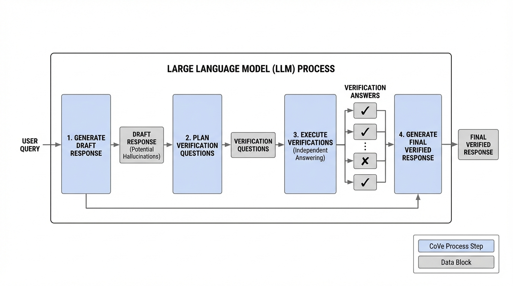
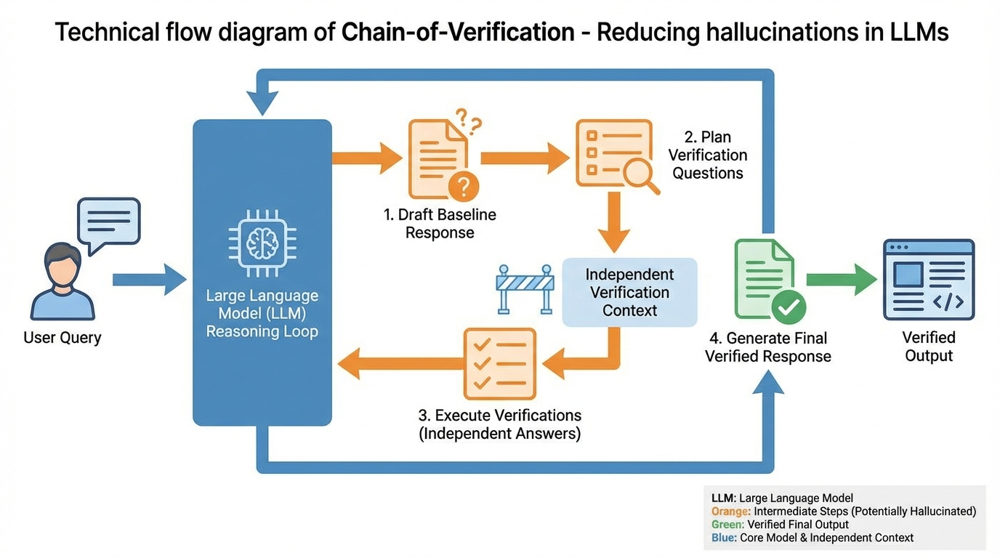
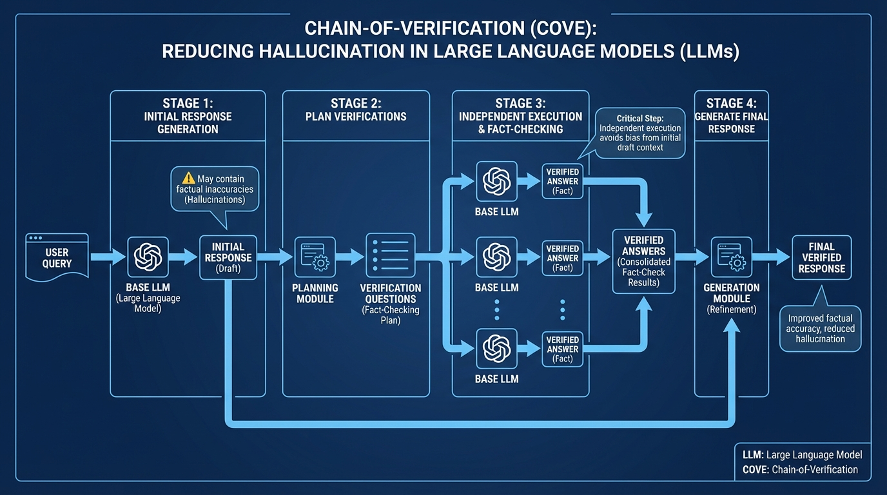

# Chain-of-Verification Reduces Hallucination
- Paper: [Chain-of-Verification_Reduces_Hallucination.pdf](../../../reinforcement_learning_papers/09_agentic_rl/Chain-of-Verification_Reduces_Hallucination.pdf)

## Gemini diagrams

### Minimal block

### Flat color + icons

### Hand-drawn sketch

### Blueprint schematic

