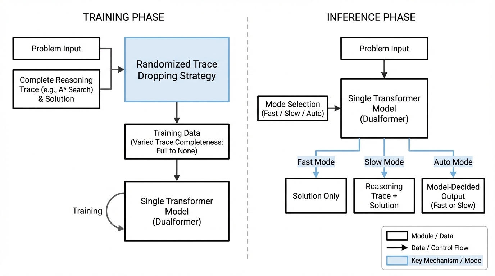
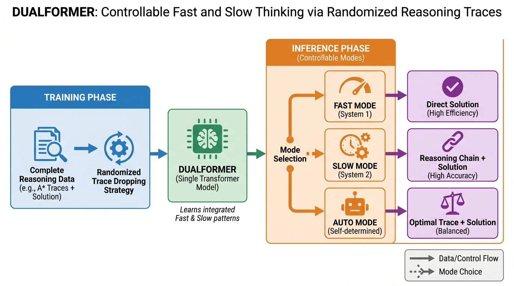
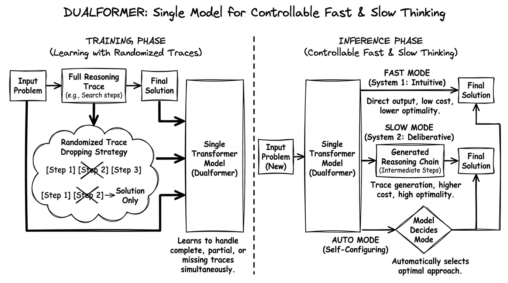

# Dualformer Controllable Fast and Slow Thinking
- Paper: [Dualformer_Controllable_Fast_and_Slow_Thinking.pdf](../../../reinforcement_learning_papers/09_agentic_rl/Dualformer_Controllable_Fast_and_Slow_Thinking.pdf)

## Gemini diagrams

### Minimal block

### Flat color + icons

### Hand-drawn sketch

### Blueprint schematic

