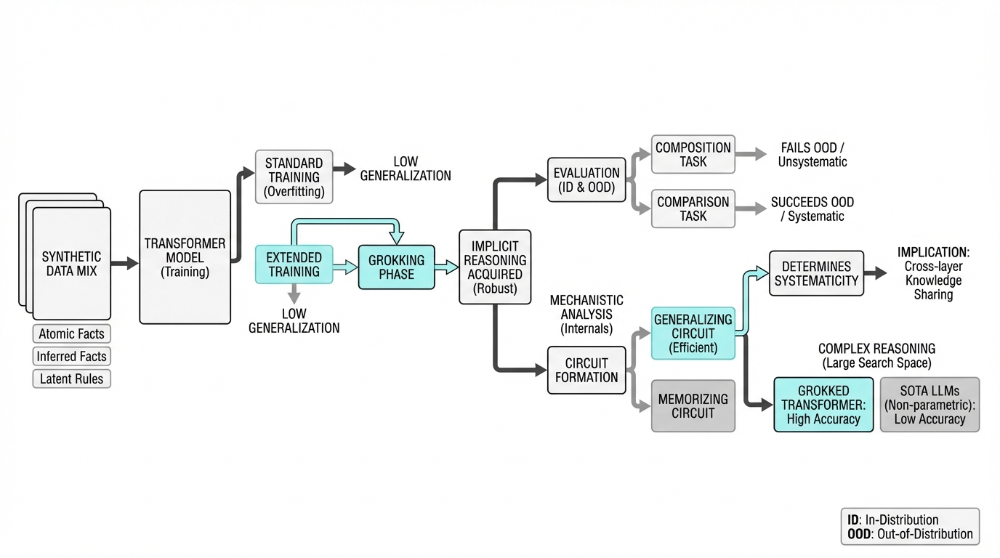
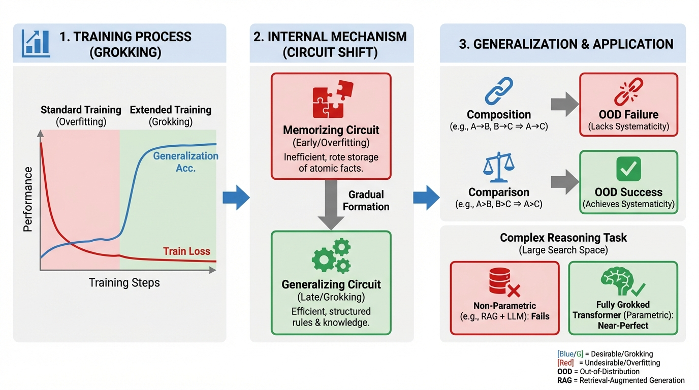
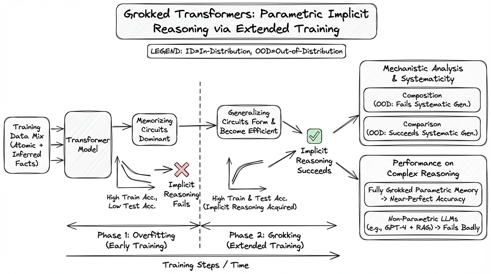
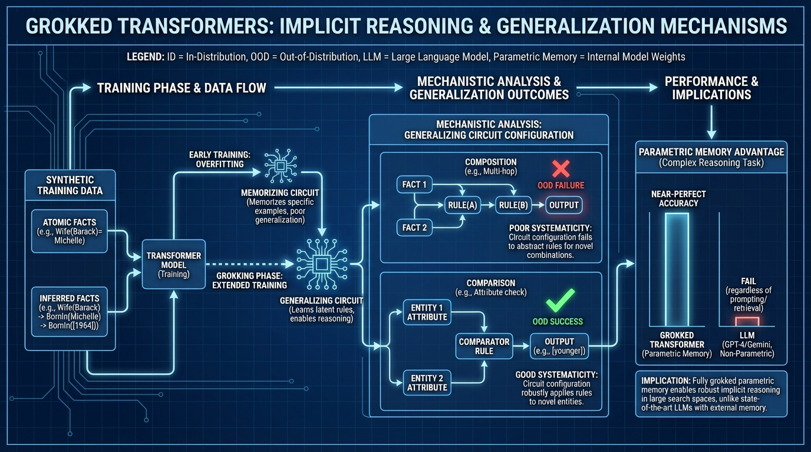

# Grokked Transformers are Implicit Reasoners
- Paper: [Grokked_Transformers_are_Implicit_Reasoners.pdf](../../../reinforcement_learning_papers/09_agentic_rl/Grokked_Transformers_are_Implicit_Reasoners.pdf)

## Gemini diagrams

### Minimal block

### Flat color + icons

### Hand-drawn sketch

### Blueprint schematic

