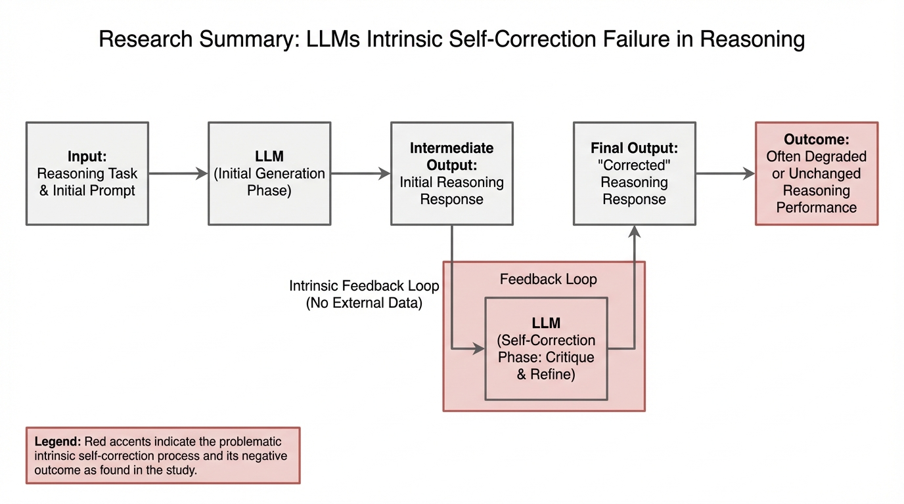
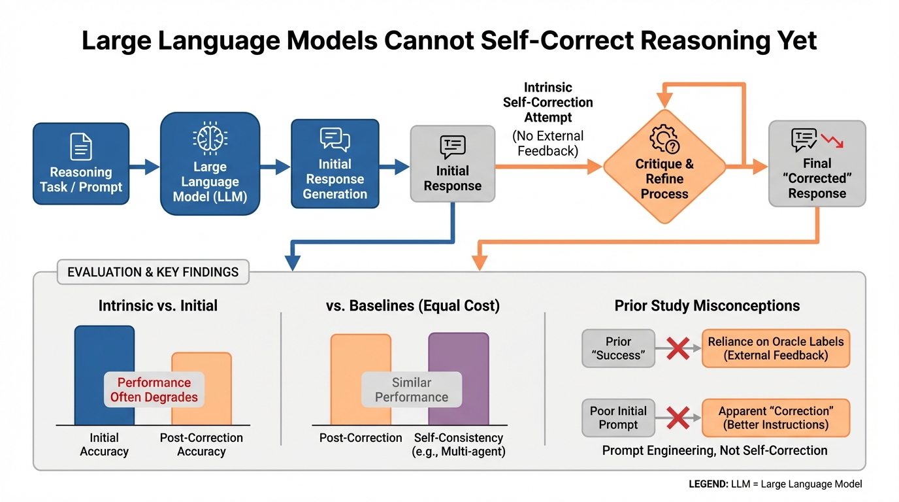
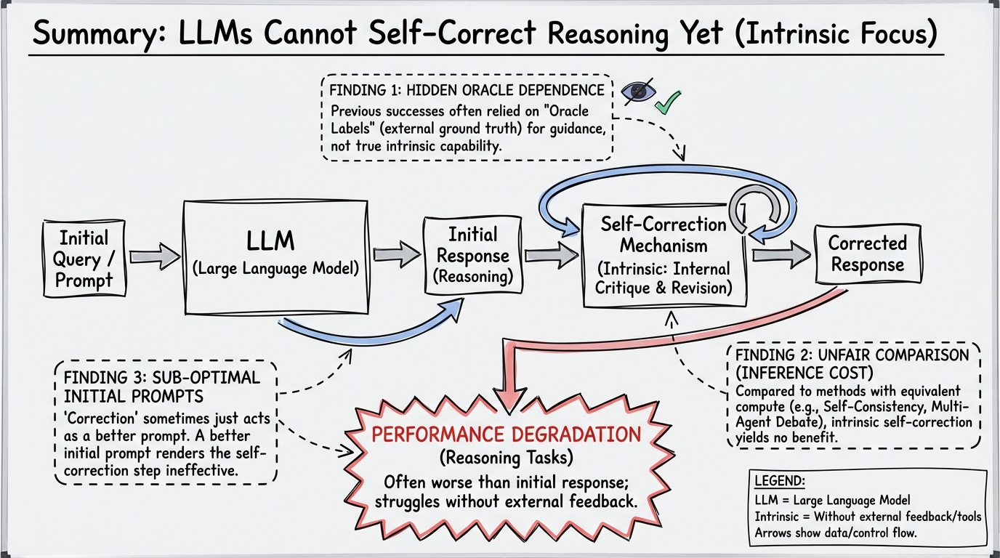
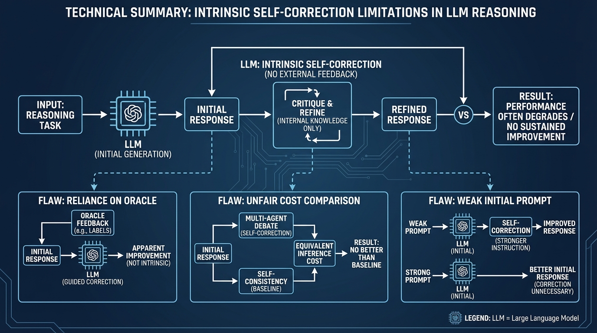

# Large Language Models Cannot Self-Correct Reasoning Yet
- Paper: [Large_Language_Models_Cannot_Self-Correct_Reasoning_Yet.pdf](../../../papers/reasoning/Large_Language_Models_Cannot_Self-Correct_Reasoning_Yet.pdf)

## Gemini diagrams

### Minimal block

### Flat color + icons

### Hand-drawn sketch

### Blueprint schematic

