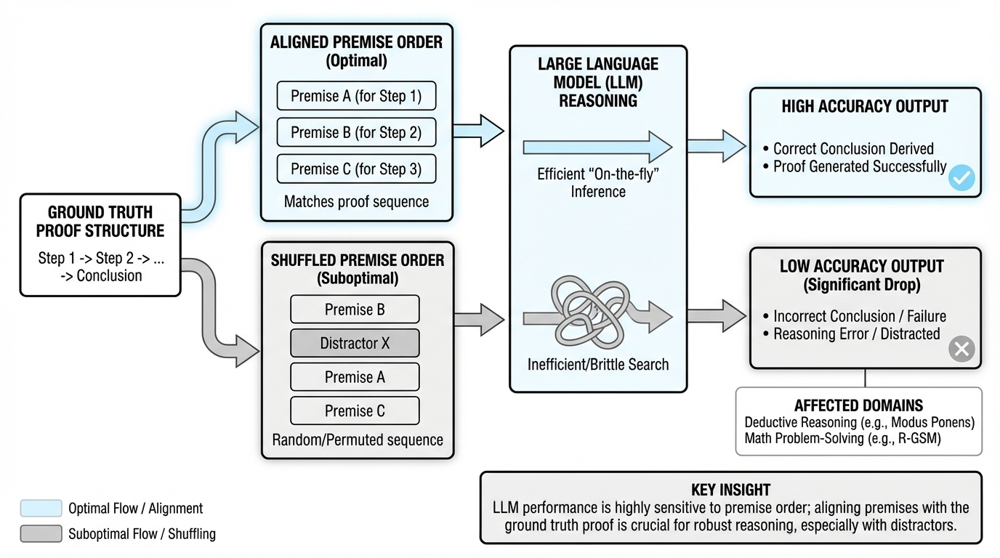
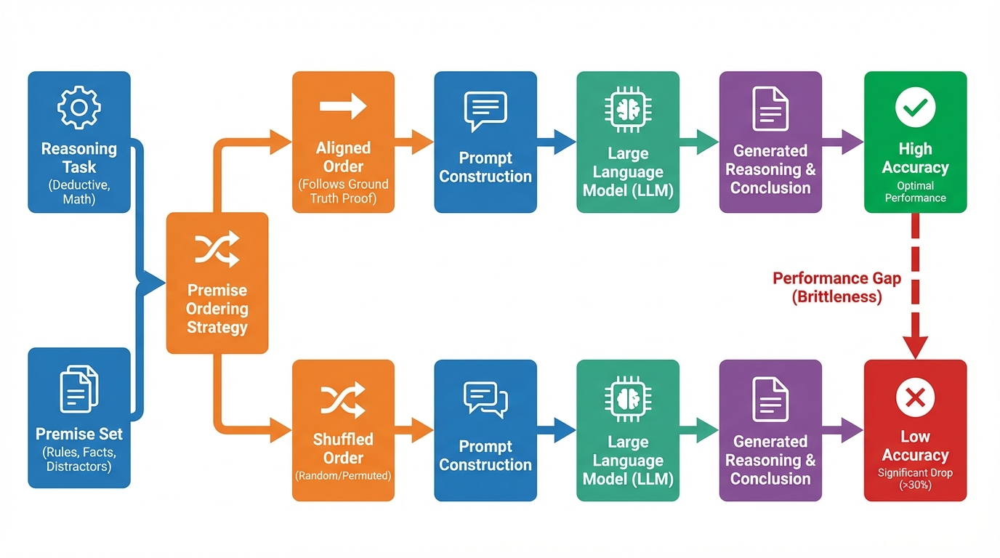
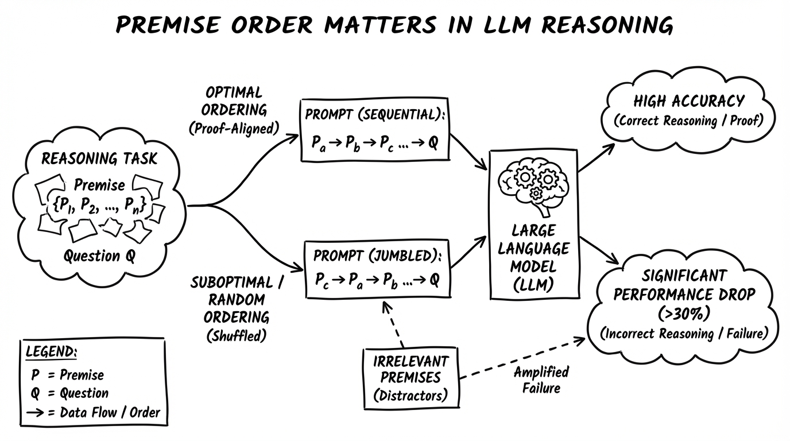
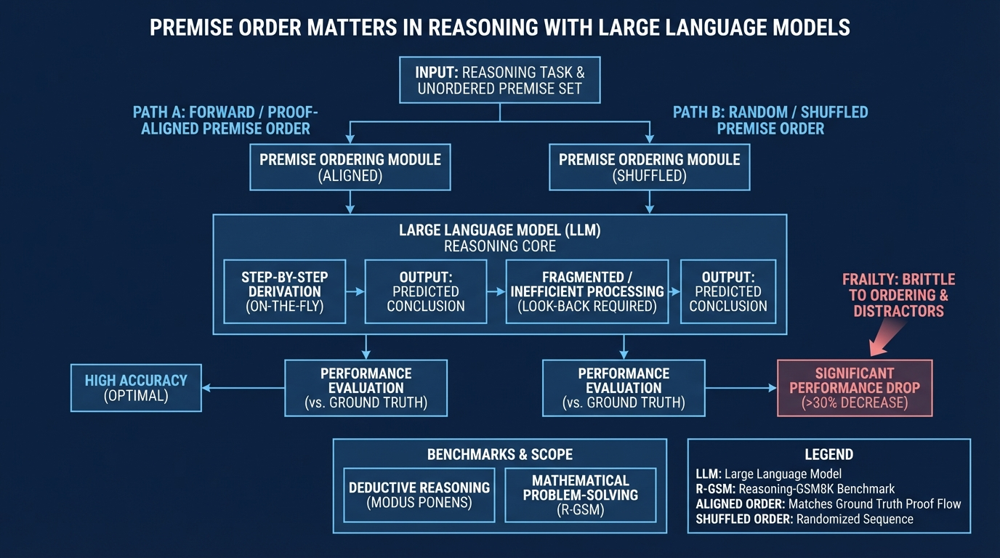

# Premise Order Matters in Reasoning with Large Language Models
- Paper: [Premise_Order_Matters_in_Reasoning_with_Large_Language_Models.pdf](../../../papers/reasoning/Premise_Order_Matters_in_Reasoning_with_Large_Language_Models.pdf)

## Gemini diagrams

### Minimal block

### Flat color + icons

### Hand-drawn sketch

### Blueprint schematic

