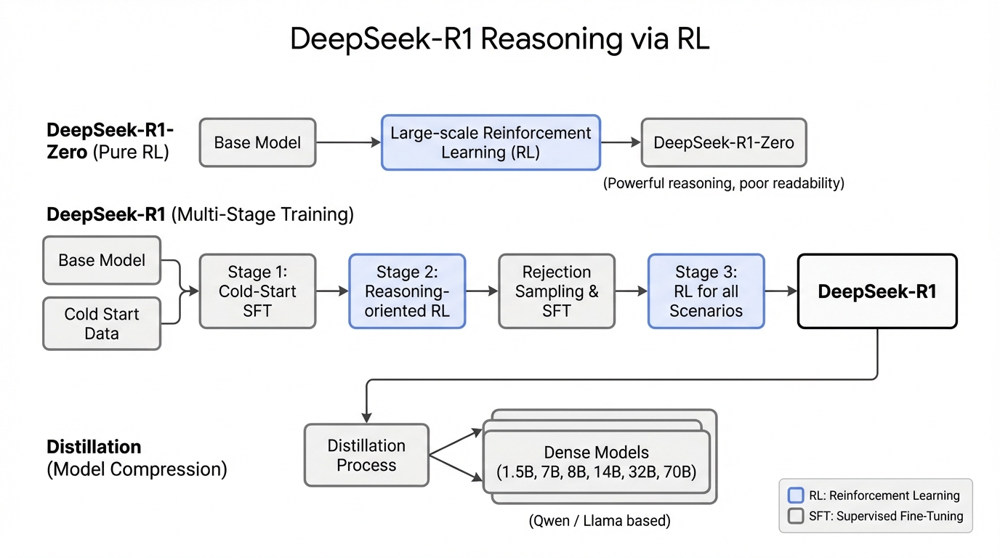
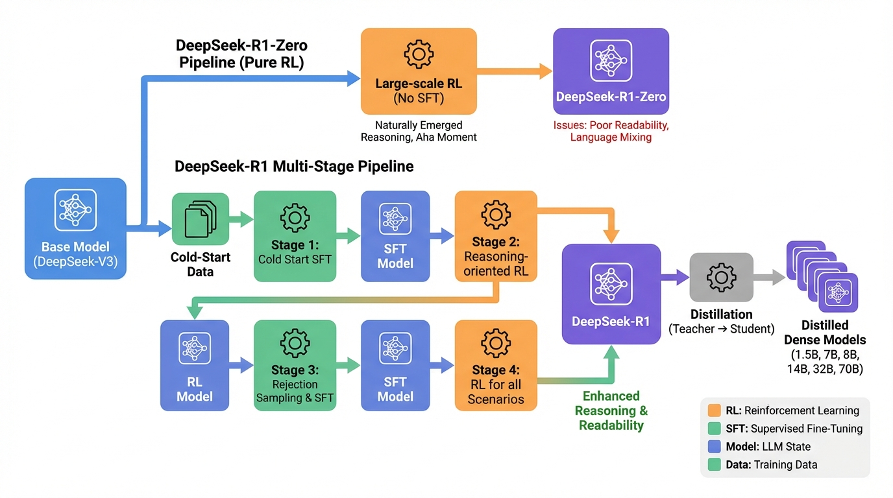
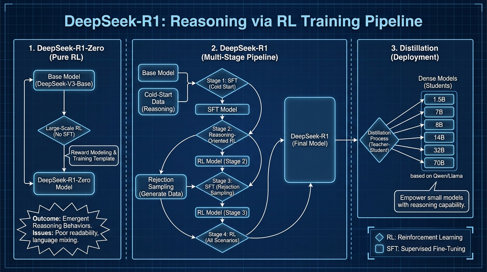

# DeepSeek-R1 Reasoning via RL
- Paper: [DeepSeek-R1_Reasoning_via_RL.pdf](../../../papers/rl-finetuning/DeepSeek-R1_Reasoning_via_RL.pdf)

## Gemini diagrams

### Minimal block

### Flat color + icons

### Hand-drawn sketch

### Blueprint schematic

