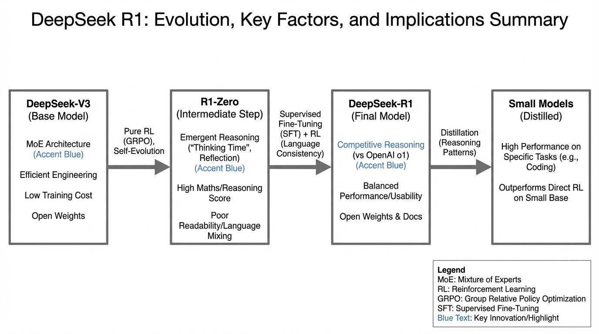
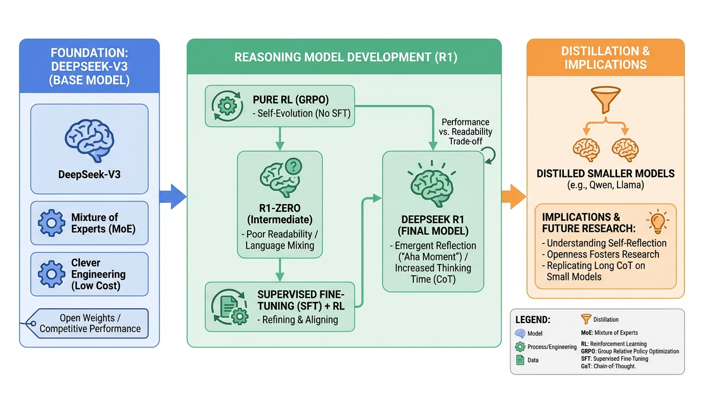
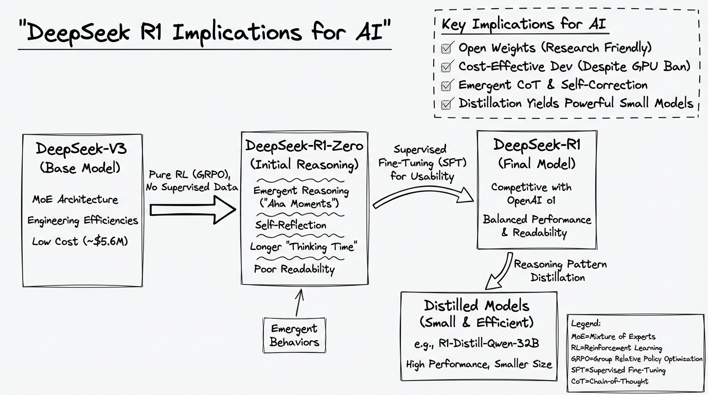
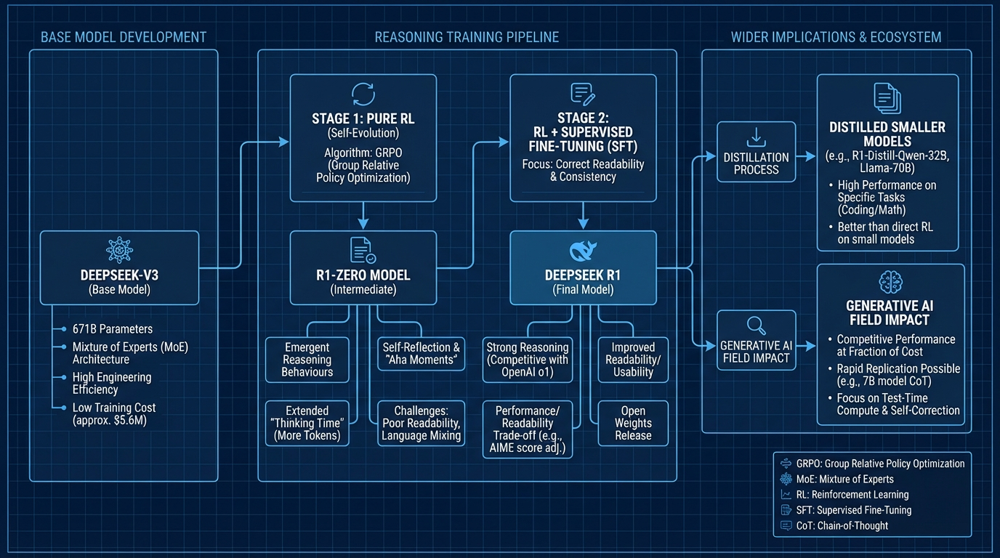

# DeepSeek R1 Implications for AI
- Paper: [DeepSeek_R1_Implications_for_AI.pdf](../../../papers/rl-finetuning/DeepSeek_R1_Implications_for_AI.pdf)

## Gemini diagrams

### Minimal block

### Flat color + icons

### Hand-drawn sketch

### Blueprint schematic

