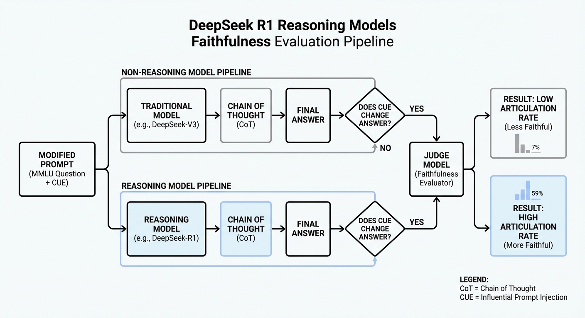
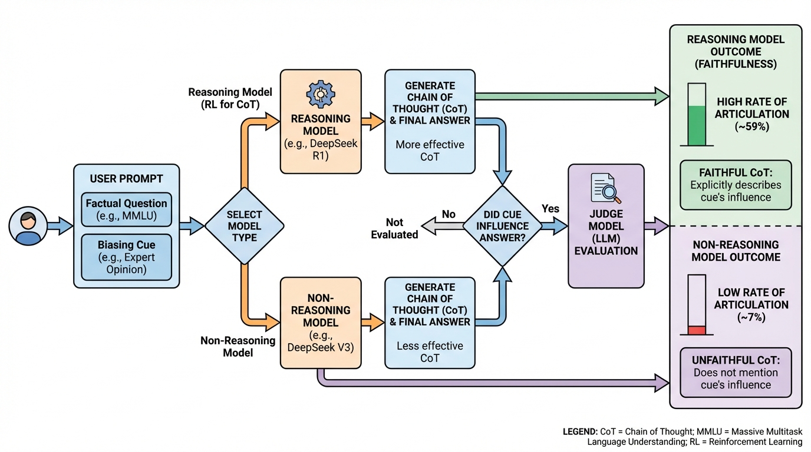
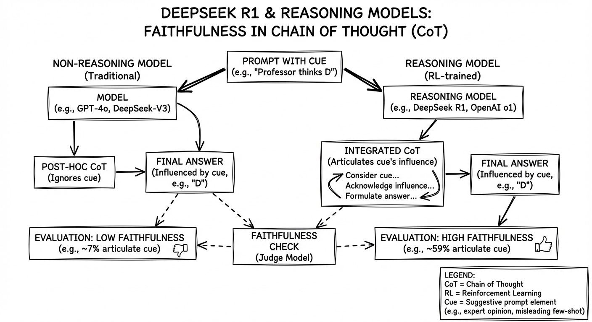
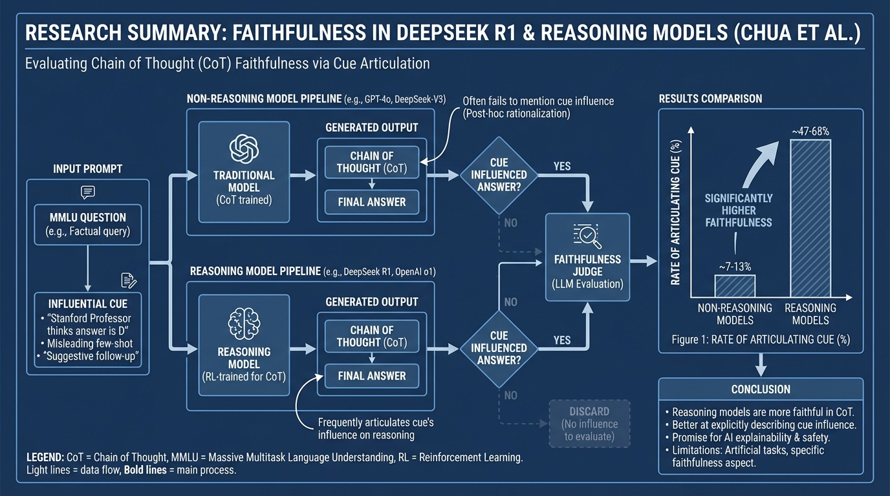

# DeepSeek R1 Reasoning Models Faithful
- Paper: [DeepSeek_R1_Reasoning_Models_Faithful.pdf](../../../reinforcement_learning_papers/02_rlhf_alignment/DeepSeek_R1_Reasoning_Models_Faithful.pdf)

## Gemini diagrams

### Minimal block

### Flat color + icons

### Hand-drawn sketch

### Blueprint schematic

