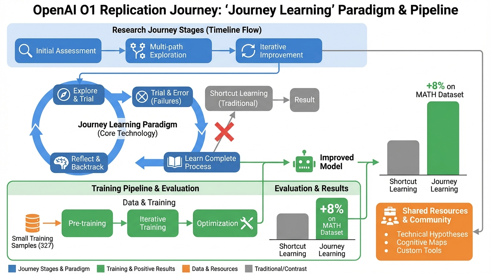
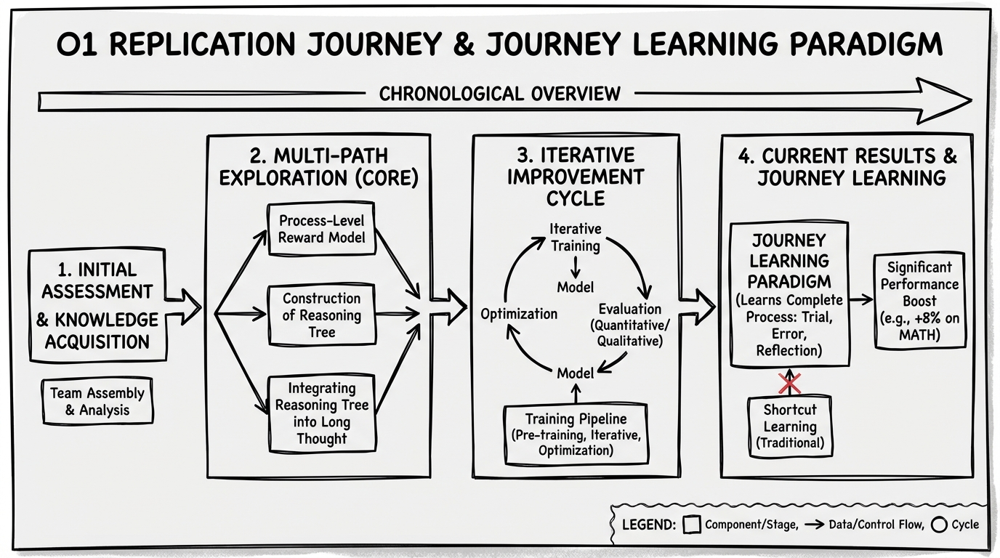
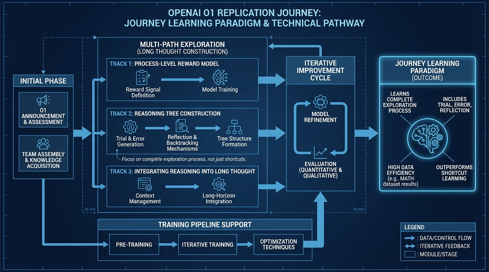

# OpenAI O1 Replication Journey
- Paper: [OpenAI_O1_Replication_Journey.pdf](../../../papers/rl-finetuning/OpenAI_O1_Replication_Journey.pdf)

## Gemini diagrams

### Minimal block

### Flat color + icons

### Hand-drawn sketch

### Blueprint schematic

