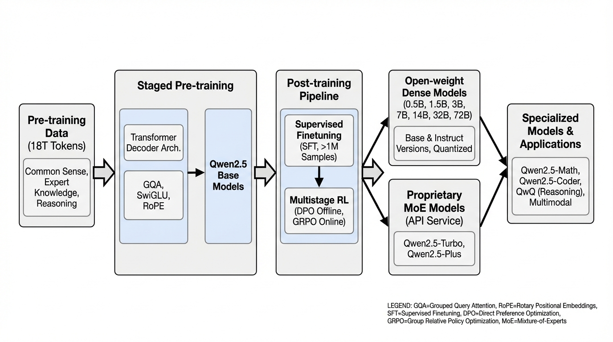
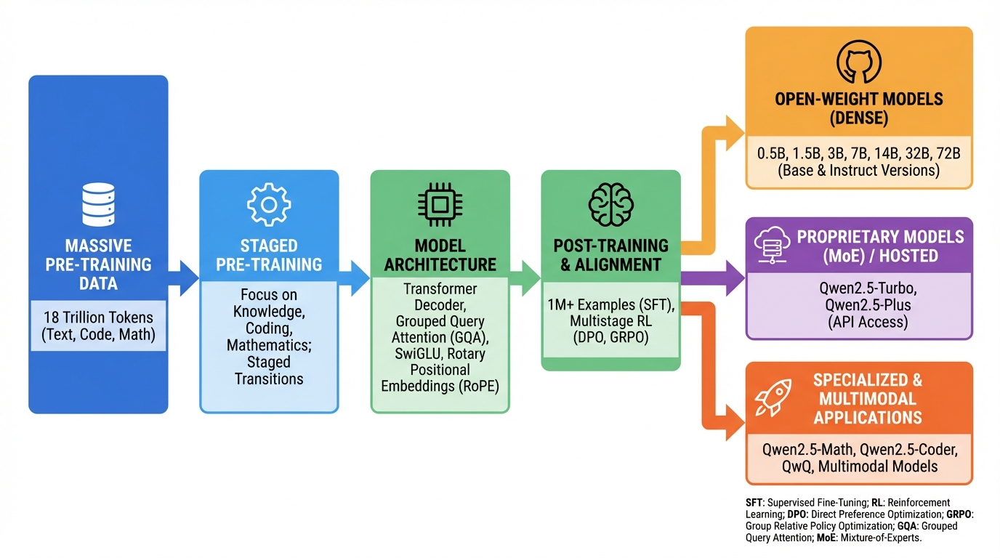
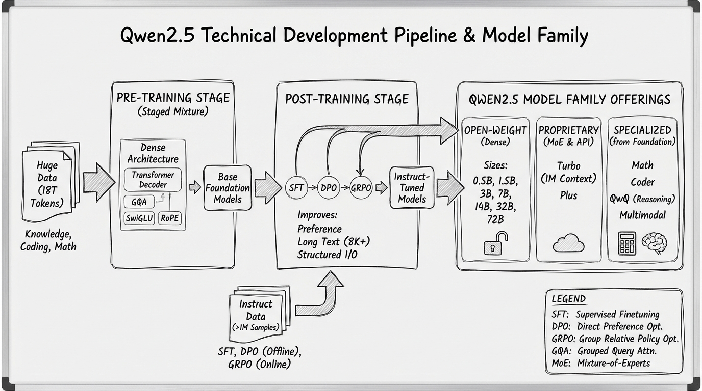
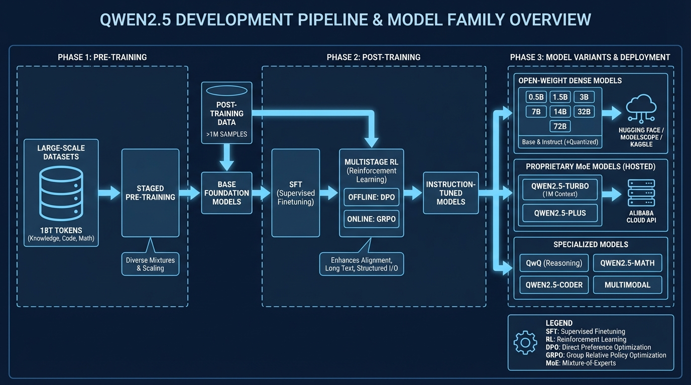

# Qwen QwQ Reasoning Model
- Paper: [Qwen_QwQ_Reasoning_Model.pdf](../../../papers/rl-finetuning/Qwen_QwQ_Reasoning_Model.pdf)

## Gemini diagrams

### Minimal block

### Flat color + icons

### Hand-drawn sketch

### Blueprint schematic

