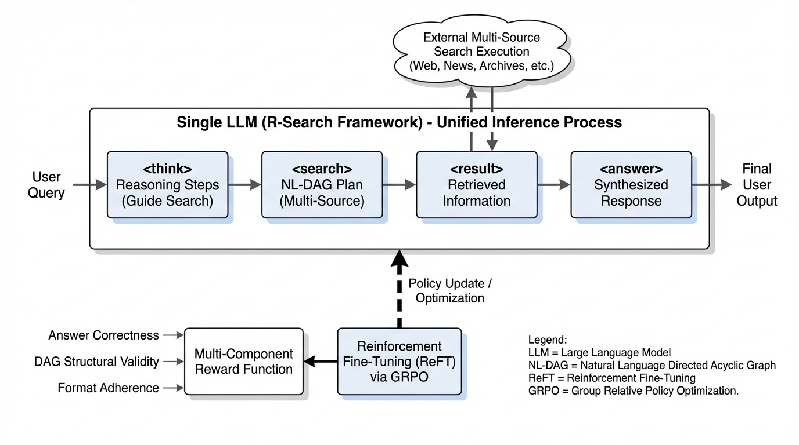
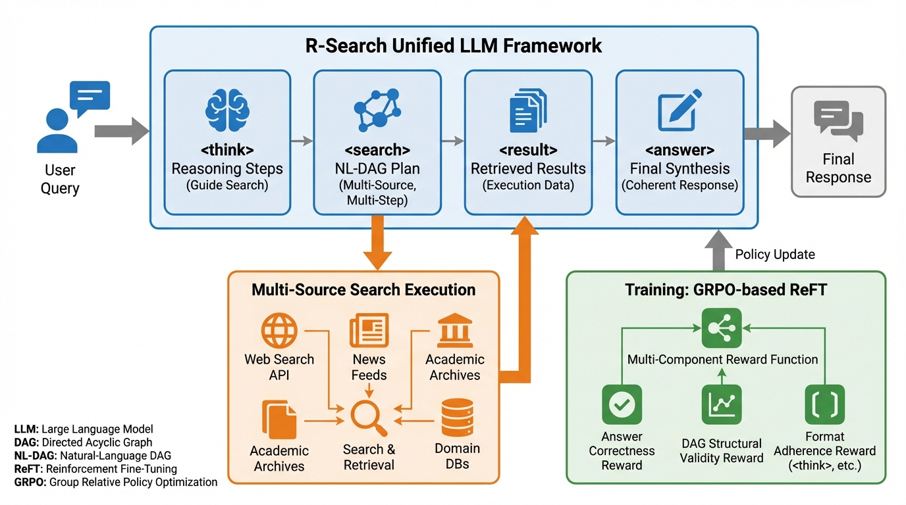
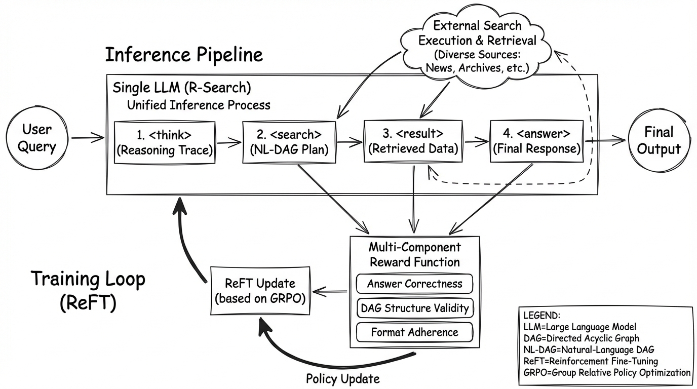
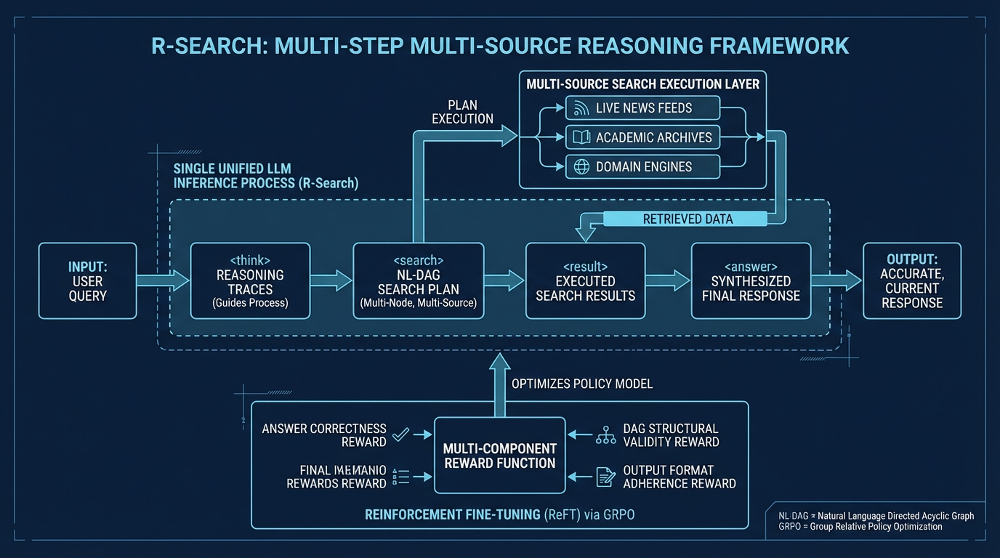

# R-Search Multi-Step Reasoning
- Paper: [R-Search_Multi-Step_Reasoning.pdf](../../../papers/rl-finetuning/R-Search_Multi-Step_Reasoning.pdf)

## Gemini diagrams

### Minimal block

### Flat color + icons

### Hand-drawn sketch

### Blueprint schematic

