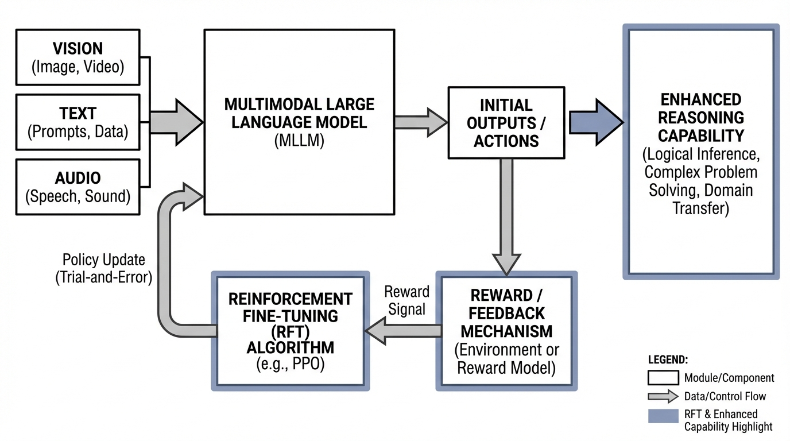
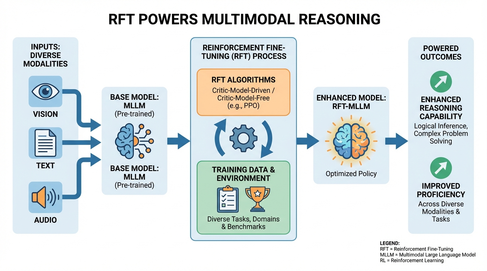
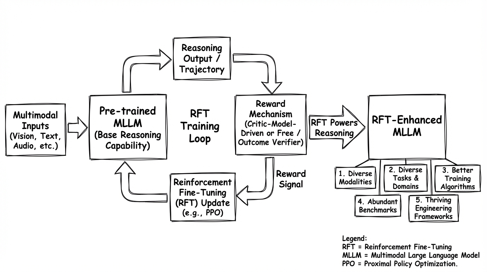
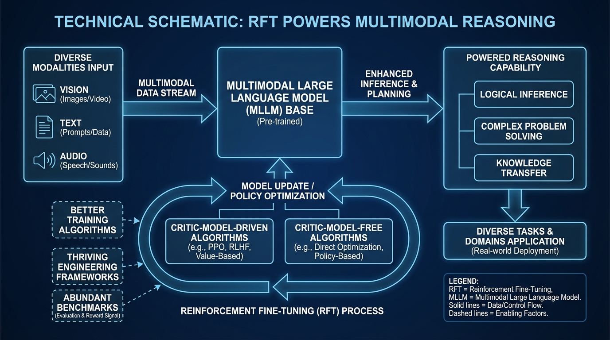

# RFT Powers Multimodal Reasoning
- Paper: [RFT_Powers_Multimodal_Reasoning.pdf](../../../papers/rl-finetuning/RFT_Powers_Multimodal_Reasoning.pdf)

## Gemini diagrams

### Minimal block

### Flat color + icons

### Hand-drawn sketch

### Blueprint schematic

