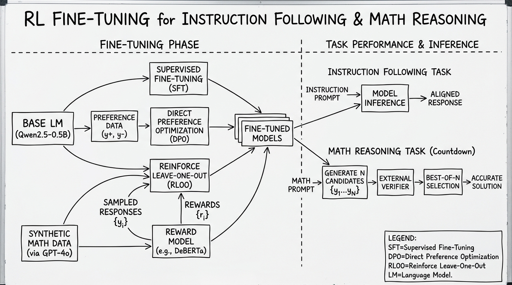
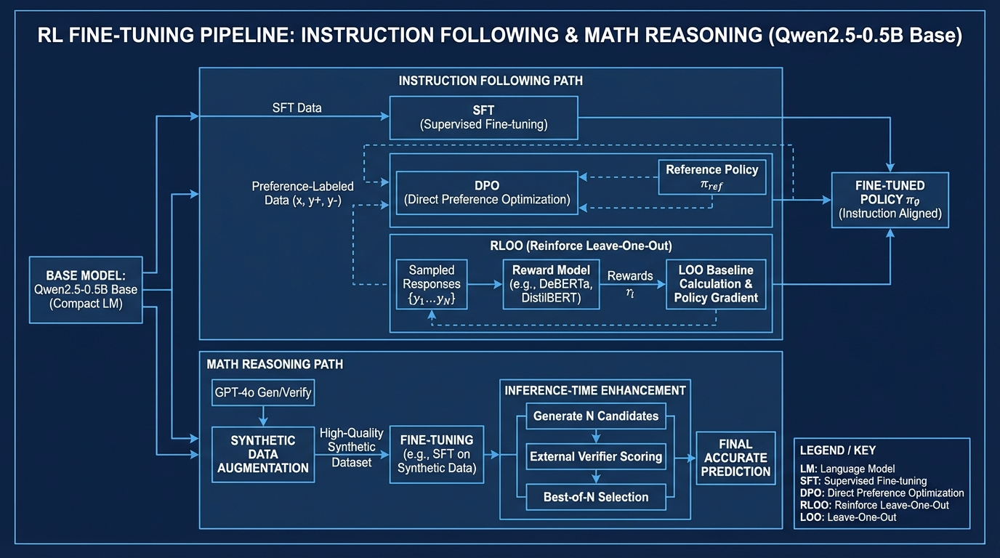

# RL Fine-tuning Instruction Following
- Paper: [RL_Fine-tuning_Instruction_Following.pdf](../../../reinforcement_learning_papers/02_rlhf_alignment/RL_Fine-tuning_Instruction_Following.pdf)

## Gemini diagrams

### Minimal block

### Flat color + icons

### Hand-drawn sketch

### Blueprint schematic

