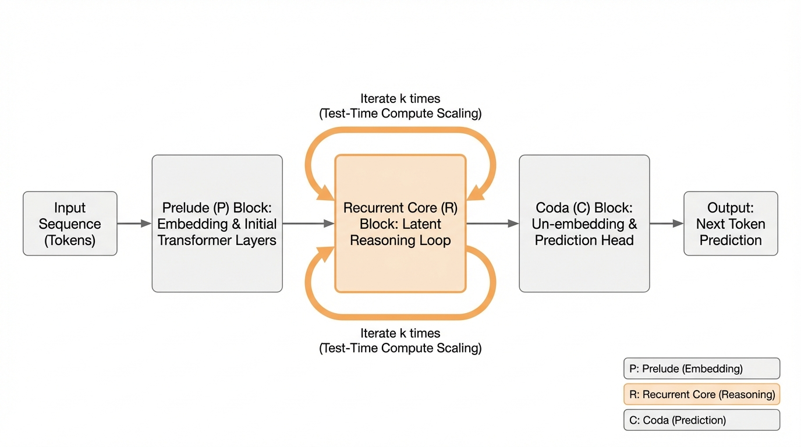
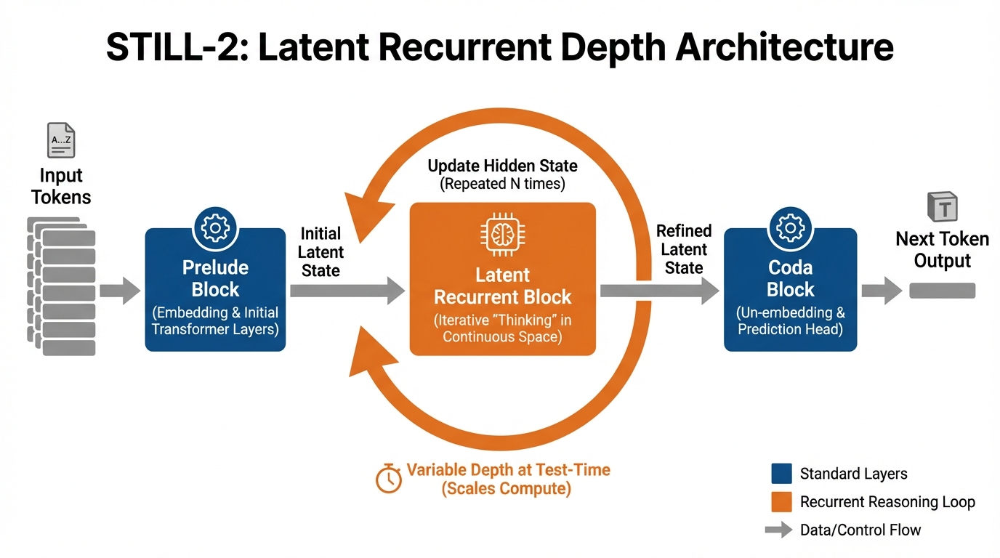
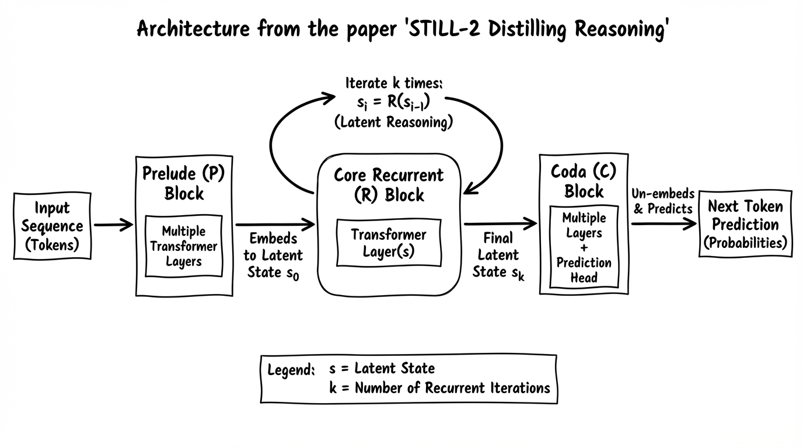
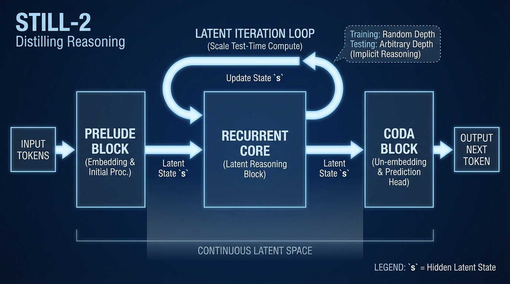

# STILL-2 Distilling Reasoning
- Paper: [STILL-2_Distilling_Reasoning.pdf](../../../reinforcement_learning_papers/02_rlhf_alignment/STILL-2_Distilling_Reasoning.pdf)

## Gemini diagrams

### Minimal block

### Flat color + icons

### Hand-drawn sketch

### Blueprint schematic

