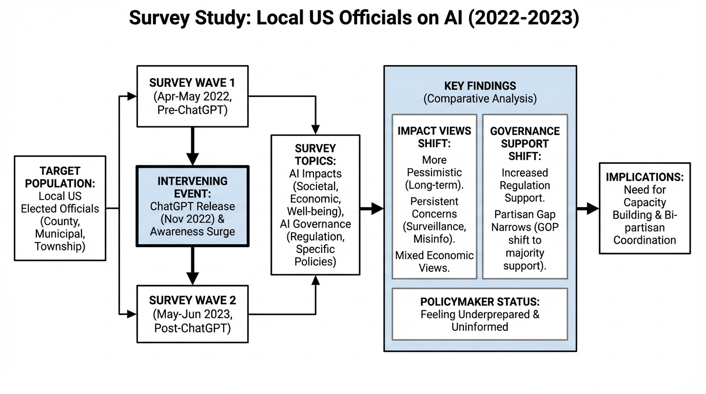
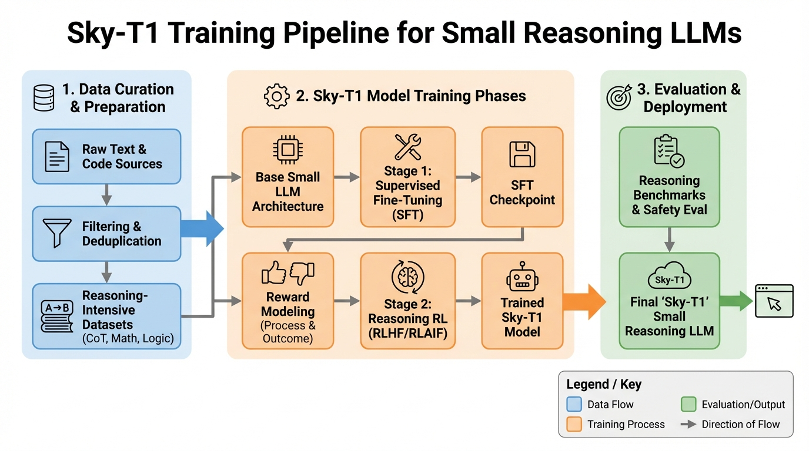
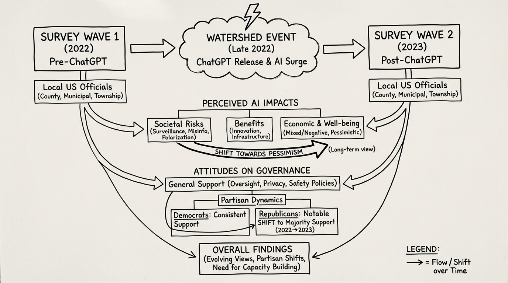
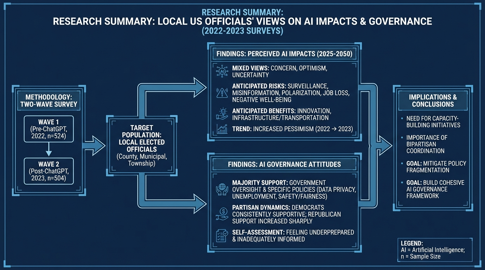

# Sky-T1 Training Small Reasoning LLMs
- Paper: [Sky-T1_Training_Small_Reasoning_LLMs.pdf](../../../reinforcement_learning_papers/02_rlhf_alignment/Sky-T1_Training_Small_Reasoning_LLMs.pdf)

## Gemini diagrams

### Minimal block

### Flat color + icons

### Hand-drawn sketch

### Blueprint schematic

