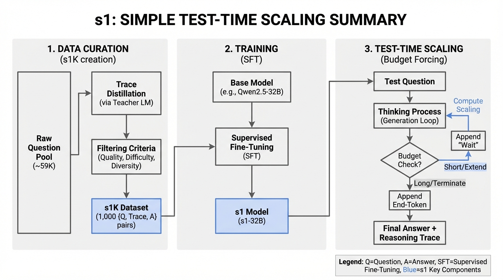
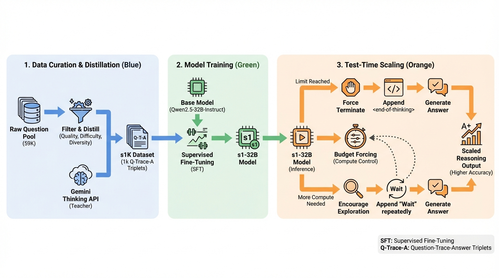
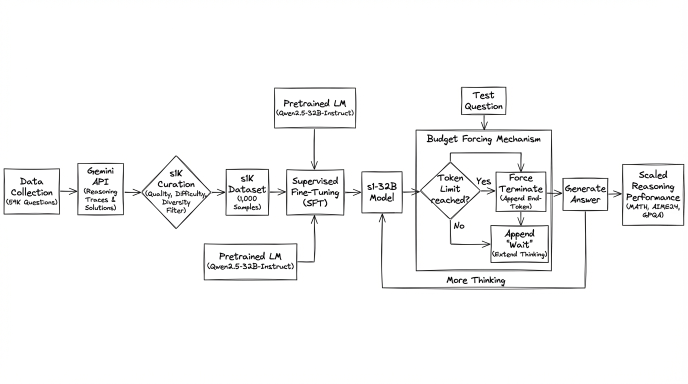
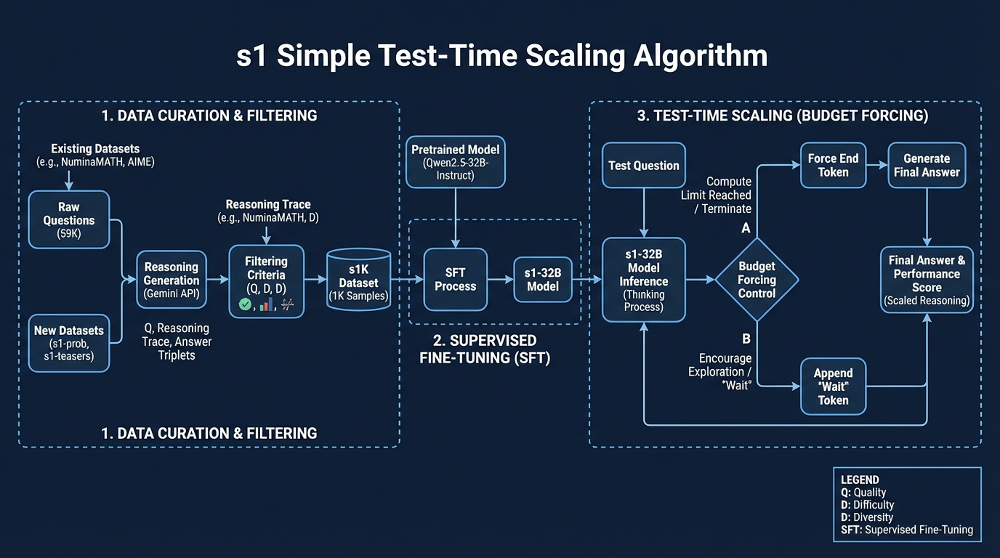

# s1 Simple Test-Time Scaling
- Paper: [s1_Simple_Test-Time_Scaling.pdf](../../../reinforcement_learning_papers/02_rlhf_alignment/s1_Simple_Test-Time_Scaling.pdf)

## Gemini diagrams

### Minimal block

### Flat color + icons

### Hand-drawn sketch

### Blueprint schematic

