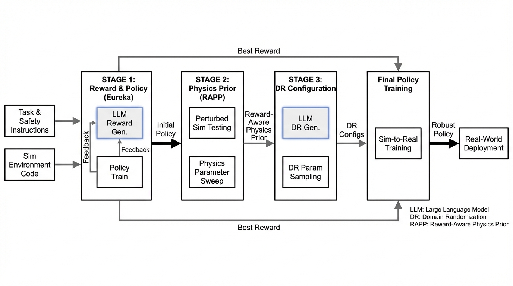
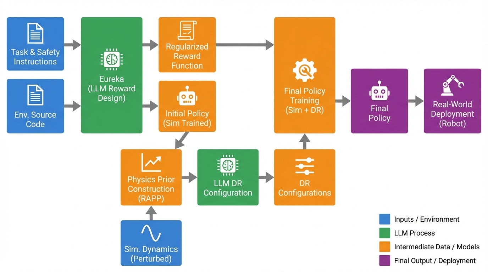
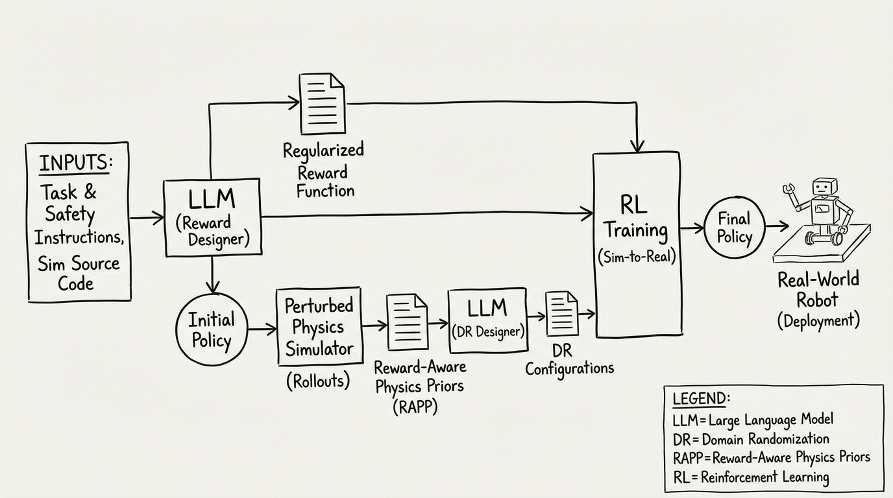

# DrEureka Language Model Guided Sim-To-Real
- Paper: [DrEureka_Language_Model_Guided_Sim-To-Real.pdf](../../../reinforcement_learning_papers/16_applied_rl/DrEureka_Language_Model_Guided_Sim-To-Real.pdf)

## Gemini diagrams

### Minimal block

### Flat color + icons

### Hand-drawn sketch

