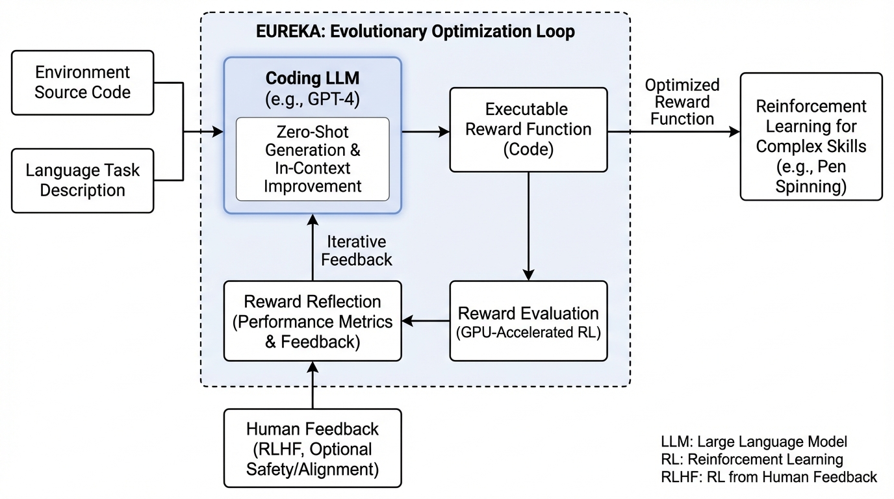
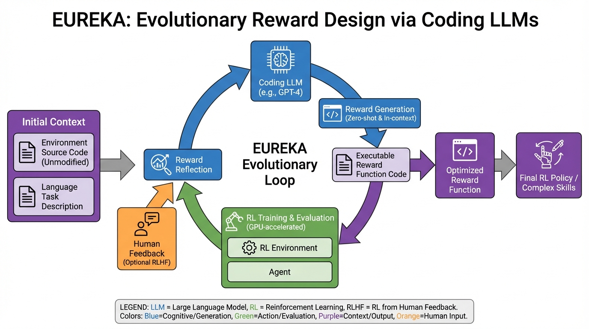
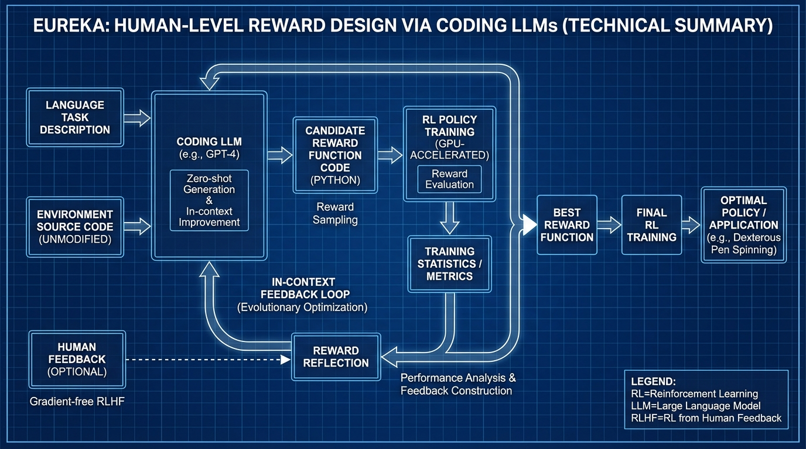

# Eureka Human-Level Reward Design
- Paper: [Eureka_Human-Level_Reward_Design.pdf](../../../papers/robotics/Eureka_Human-Level_Reward_Design.pdf)

## Gemini diagrams

### Minimal block

### Flat color + icons

### Hand-drawn sketch

### Blueprint schematic

