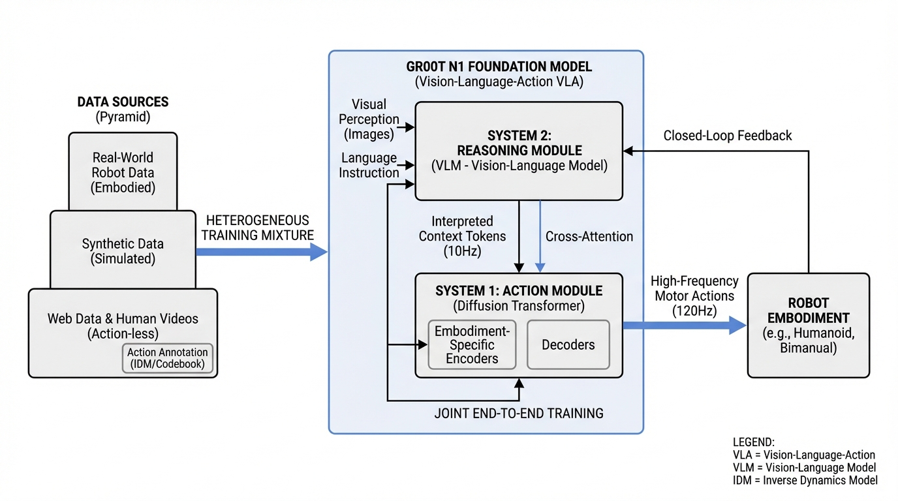
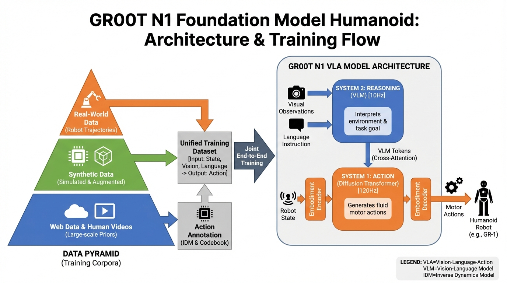
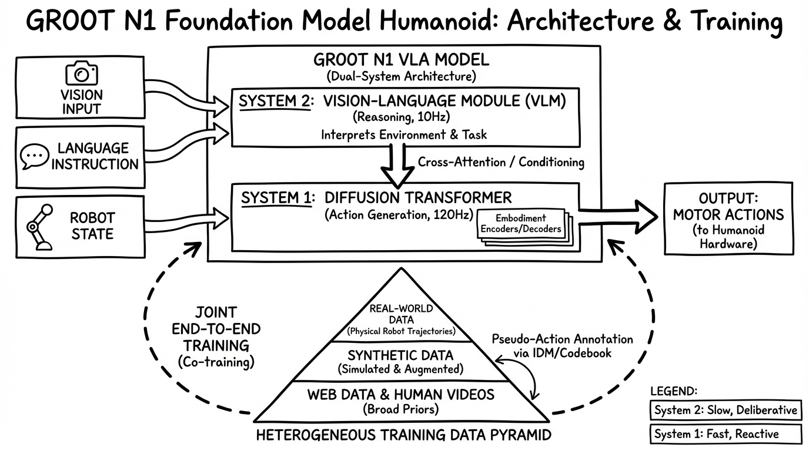
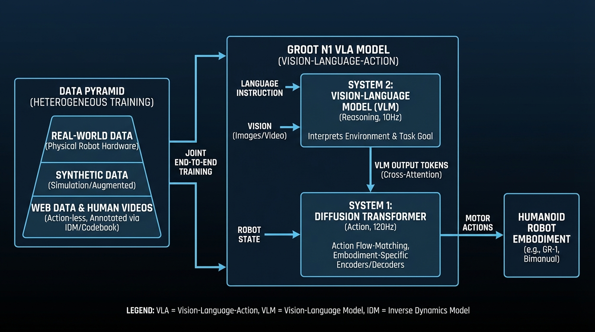

# GR00T N1 Foundation Model Humanoid
- Paper: [GR00T_N1_Foundation_Model_Humanoid.pdf](../../../papers/robotics/GR00T_N1_Foundation_Model_Humanoid.pdf)

## Gemini diagrams

### Minimal block

### Flat color + icons

### Hand-drawn sketch

### Blueprint schematic

